# OARC-Crawlers: Components and Implementations

This document provides in-depth explanations of the various crawlers and components in the OARC-Crawlers framework, including data flow diagrams, implementation details, and advanced usage patterns.

## Table of Contents
- [1. Parquet Storage](#1-parquet-storage)
  - [1.1 Architecture](#11-architecture)
  - [1.2 Data Flow](#12-data-flow)
  - [1.3 Advanced Usage](#13-advanced-usage)
  - [1.4 Schema Management](#14-schema-management)
- [2. YouTube Downloader](#2-youtube-downloader)
  - [2.1 Architecture](#21-architecture)
  - [2.2 Video Download Process](#22-video-download-process)
  - [2.3 Playlist Handling](#23-playlist-handling)
  - [2.4 Caption Extraction](#24-caption-extraction)
  - [2.5 Search Functionality](#25-search-functionality)
- [3. GitHub Crawler](#3-github-crawler)
  - [3.1 Architecture](#31-architecture)
  - [3.2 Repository Processing](#32-repository-processing)
  - [3.3 Code Analysis](#33-code-analysis)
  - [3.4 Similarity Detection](#34-similarity-detection)
- [4. DuckDuckGo Searcher](#4-duckduckgo-searcher)
  - [4.1 Architecture](#41-architecture)
  - [4.2 Search Types](#42-search-types)
  - [4.3 Result Processing](#43-result-processing)
  - [4.4 Privacy Considerations](#44-privacy-considerations)
- [5. BeautifulSoup Web Crawler](#5-beautifulsoup-web-crawler)
  - [5.1 Architecture](#51-architecture)
  - [5.2 Content Extraction](#52-content-extraction)
  - [5.3 Specialized Extractors](#53-specialized-extractors)
  - [5.4 Document Formatting](#54-document-formatting)
- [6. ArXiv Fetcher](#6-arxiv-fetcher)
  - [6.1 Architecture](#61-architecture)
  - [6.2 Metadata Extraction](#62-metadata-extraction)
  - [6.3 LaTeX Processing](#63-latex-processing)
  - [6.4 Combined Workflows](#64-combined-workflows)
- [7. Appendix](#7-appendix)
  - [7.1 Glossary of Terms](#71-glossary-of-terms)

## 1. Parquet Storage

The ParquetStorage component is the cornerstone of the OARC-Crawlers framework, providing a unified mechanism for efficient data persistence across all modules.

### 1.1 Architecture

ParquetStorage is implemented as a utility class with static methods for saving, loading, and appending data in the Apache Parquet format. It abstracts away the complexities of Parquet serialization and provides a simple, consistent interface for all data storage operations.

```mermaid
classDiagram
    class ParquetStorage {
        +save_to_parquet(data, file_path) bool
        +load_from_parquet(file_path) DataFrame
        +append_to_parquet(data, file_path) bool
        -_ensure_directory_exists(file_path) None
        -_convert_to_dataframe(data) DataFrame
    }
    
    ParquetStorage --> "pd.DataFrame"
    ParquetStorage --> "pyarrow.Table"
    ParquetStorage --> "pyarrow.parquet"
```

The class is designed to handle multiple input data types, automatically converting between them as needed:
- Python dictionaries
- Lists of dictionaries
- Pandas DataFrames
- Nested structures with JSON-compatible types

### 1.2 Data Flow

The data flow through the ParquetStorage system follows a consistent pattern regardless of the source crawler:

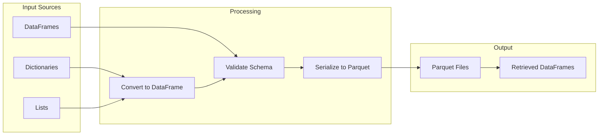

This architecture ensures that all data, regardless of its original format, is normalized to a consistent Parquet representation, facilitating later analysis and integration.

### 1.3 Advanced Usage

ParquetStorage provides several advanced features for handling complex data scenarios:

1. **Schema Evolution**: When appending data to existing files, ParquetStorage handles schema differences by identifying common fields, allowing for flexible schema evolution over time.

2. **Automatic Type Conversion**: The system automatically converts Python types to appropriate Parquet/Arrow types, including complex nested structures.

3. **Error Recovery**: During loading operations, ParquetStorage implements fault-tolerant behavior, returning None instead of raising exceptions for missing files or corrupted data, simplifying error handling in crawler code.

4. **Directory Management**: The system automatically creates necessary directory structures when saving files, reducing the burden on individual crawler implementations.

Example for handling schema evolution:
```python
# Initial data with a certain schema
initial_data = {'id': 1, 'name': 'Example', 'score': 95}
ParquetStorage.save_to_parquet(initial_data, 'data.parquet')

# Later, append data with a different schema
new_data = {'id': 2, 'name': 'Another Example', 'grade': 'A'}  # 'score' missing, 'grade' added
ParquetStorage.append_to_parquet(new_data, 'data.parquet')

# The resulting file will contain both records with a unified schema
# id | name           | score | grade
# -------------------+-------+------
# 1  | Example       | 95    | null
# 2  | Another Example | null  | A
```

### 1.4 Schema Management

For projects with well-defined data structures, ParquetStorage can enforce schema consistency:

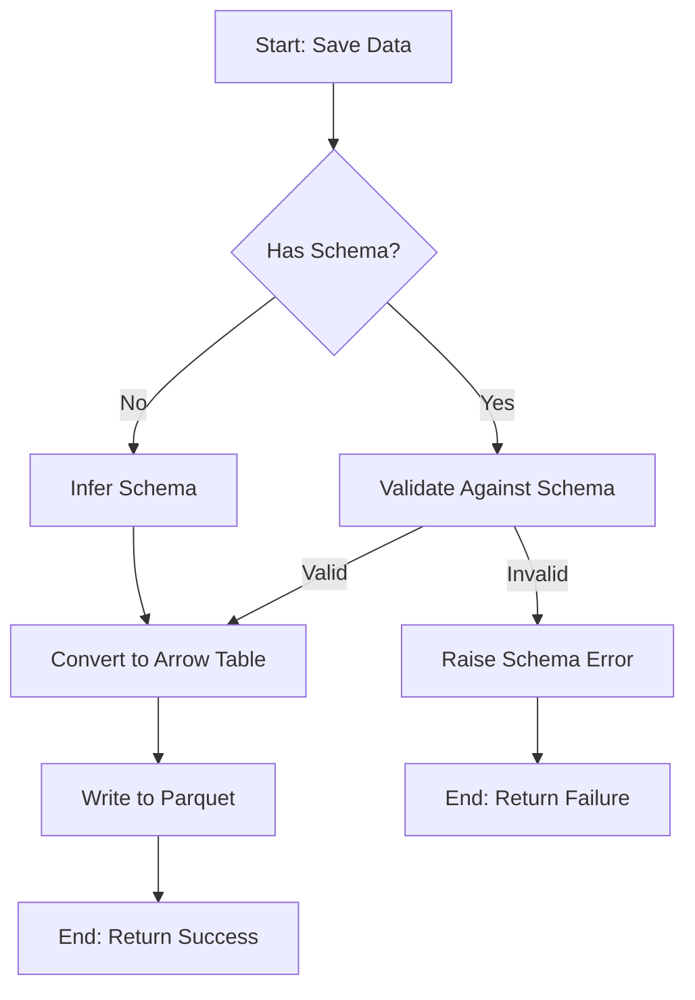

This schema validation ensures data integrity throughout the collection and storage process.

## 2. YouTube Downloader

The YouTubeDownloader module provides comprehensive capabilities for acquiring video content and metadata from YouTube.

### 2.1 Architecture

The YouTubeDownloader is implemented as a class with asynchronous methods for video operations:

```mermaid
classDiagram
    class YouTubeDownloader {
        -data_dir: str
        +__init__(data_dir)
        +download_video(url, format, resolution, ...) Dict
        +download_playlist(playlist_url, format, max_videos, ...) Dict
        +extract_captions(url, languages) Dict
        +search_videos(query, limit) Dict
        -_get_video_info(video) Dict
        -_download_stream(stream, output_path, filename) str
        -_save_video_metadata(video_info, file_path) None
    }
    
    YouTubeDownloader --> "pytube.YouTube"
    YouTubeDownloader --> "pytube.Playlist"
    YouTubeDownloader --> "ParquetStorage"
```

The module leverages the pytube library for YouTube interactions while adding significant value through:
- Asynchronous operation
- Consistent error handling
- Structured metadata extraction and storage
- Integrated Parquet persistence
- Additional capabilities like caption extraction

### 2.2 Video Download Process

The video download process involves several steps:

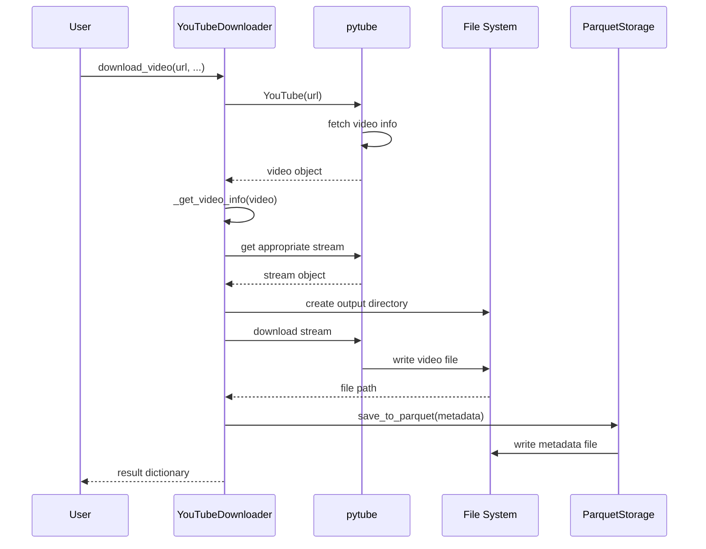

This process ensures both the video content and its associated metadata are properly saved and organized.

Key implementation details:
- Handles stream selection based on format and resolution preferences
- Manages filesystem operations for creating directories and naming files
- Extracts comprehensive metadata including title, author, publish date, view count, etc.
- Properly handles errors at each step with contextual information

### 2.3 Playlist Handling

For playlists, the YouTubeDownloader implements a sequential processing approach:

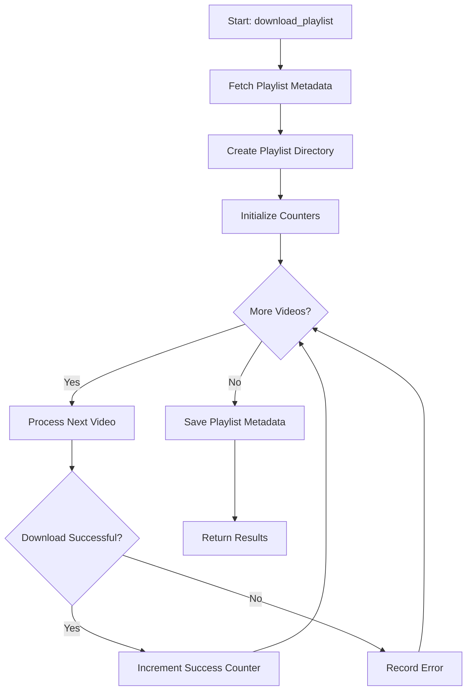

This approach:
- Processes videos sequentially to avoid rate limiting
- Tracks success and failure counts
- Continues processing despite individual video failures
- Organizes downloads in a playlist-specific directory structure
- Stores comprehensive playlist metadata

### 2.4 Caption Extraction

The caption extraction functionality provides access to subtitle data:

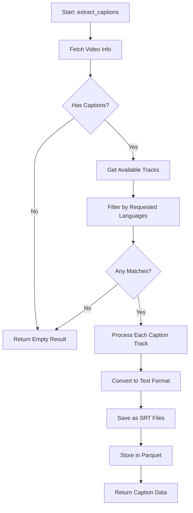

Caption extraction provides:
- Multi-language support
- Both raw SRT format and plaintext extraction
- Timestamp mapping
- Storage in both filesystem (SRT) and Parquet formats
- Detailed metadata about available languages and tracks

### 2.5 Search Functionality

The search functionality interfaces with YouTube's search capabilities:

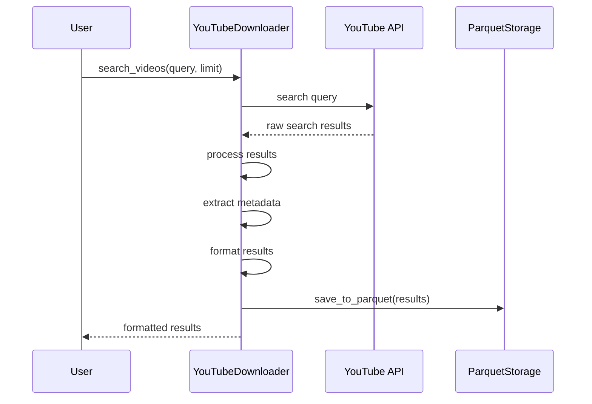

The search functionality:
- Formats results consistently
- Extracts key metadata from each video in the results
- Stores search results for later analysis
- Handles YouTube API quota limitations
- Provides both human-readable and structured data outputs

## 3. GitHub Crawler

The GitHubCrawler provides advanced capabilities for cloning, analyzing, and extracting information from GitHub repositories.

### 3.1 Architecture

The GitHubCrawler is implemented as a class with both static utility methods and instance methods for repository operations:

```mermaid
classDiagram
    class GitHubCrawler {
        -data_dir: str
        +__init__(data_dir)
        +extract_repo_info_from_url(url) Tuple
        +clone_repo(repo_url, temp_dir) Path
        +process_repo_to_dataframe(repo_path, max_file_size_kb) DataFrame
        +clone_and_store_repo(repo_url) str
        +get_repo_summary(repo_url) str
        +find_similar_code(repo_url, code_snippet) str
        +query_repo_content(repo_url, query) str
        -_process_file(file_path, repo_root) Dict
        -_detect_language(file_path, content) str
        -_calculate_similarity(code1, code2) float
    }
    
    GitHubCrawler --> "git.Repo"
    GitHubCrawler --> "ParquetStorage"
    GitHubCrawler --> "pd.DataFrame"
```

The GitHubCrawler leverages:
- GitPython for repository operations
- Language detection libraries for code analysis
- Fuzzy matching algorithms for code similarity
- Parquet storage for efficient data persistence

### 3.2 Repository Processing

The repository processing workflow involves multiple steps to transform a Git repository into an analyzable dataset:

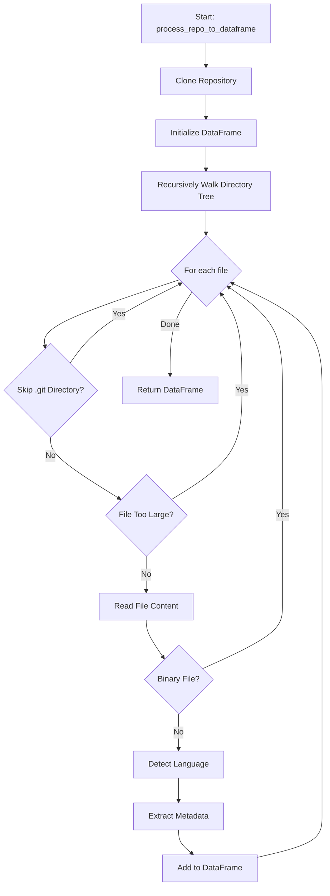

Key implementation details:
- Uses heuristics to identify binary files that should be skipped
- Extracts file metadata including size, line count, and path
- Detects programming language based on file extension and content
- Handles encoding issues gracefully
- Maintains repository structure information

### 3.3 Code Analysis

The code analysis functionality provides insights into repository contents:

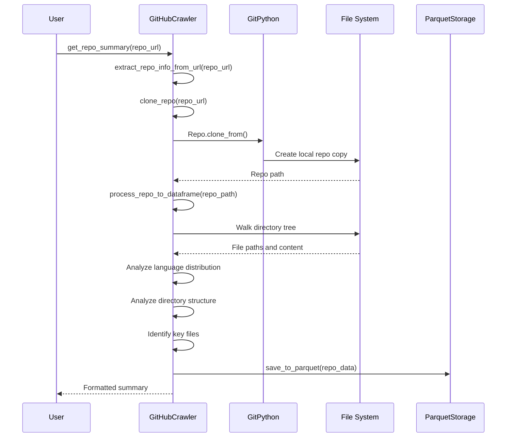

The analysis provides:
- Language distribution statistics
- Directory structure overview
- Identification of key files (README, LICENSE, etc.)
- Code complexity metrics
- Contributor information when available

### 3.4 Similarity Detection

The code similarity detection functionality identifies matching patterns in repository code:

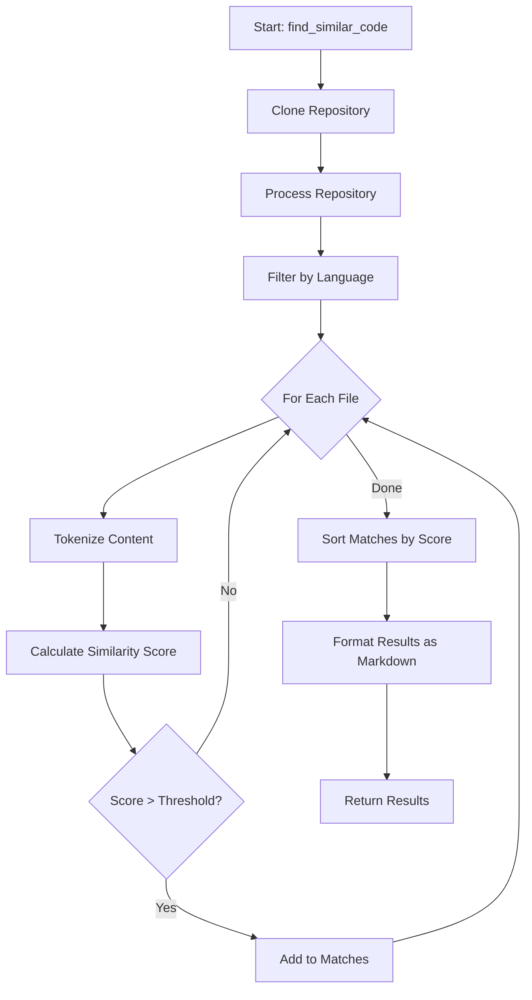

The similarity detection:
- Uses language-specific tokenization
- Applies fuzzy matching algorithms
- Calculates normalized similarity scores
- Prioritizes results by relevance
- Includes contextual information like file path and line numbers
- Formats results with syntax highlighting in markdown

## 4. DuckDuckGo Searcher

The DuckDuckGoSearcher provides a privacy-focused interface for web searches, supporting multiple search types and formats.

### 4.1 Architecture

The DuckDuckGoSearcher is implemented as a class with methods for different search types:

```mermaid
classDiagram
    class DuckDuckGoSearcher {
        -data_dir: str
        +__init__(data_dir)
        +text_search(search_query, max_results) str
        +image_search(search_query, max_results) str
        +news_search(search_query, max_results) str
        +text_search_to_dict(search_query, max_results) Dict
        +image_search_to_dict(search_query, max_results) Dict
        +news_search_to_dict(search_query, max_results) Dict
        -_sanitize_filename(filename) str
        -_format_results_as_markdown(results, query) str
    }
    
    DuckDuckGoSearcher --> "aiohttp.ClientSession"
    DuckDuckGoSearcher --> "ParquetStorage"
```

The module leverages:
- Asynchronous HTTP requests with aiohttp
- DuckDuckGo's search APIs
- Markdown formatting for human-readable output
- Parquet storage for result persistence

### 4.2 Search Types

The DuckDuckGoSearcher supports multiple search types with specialized handling for each:

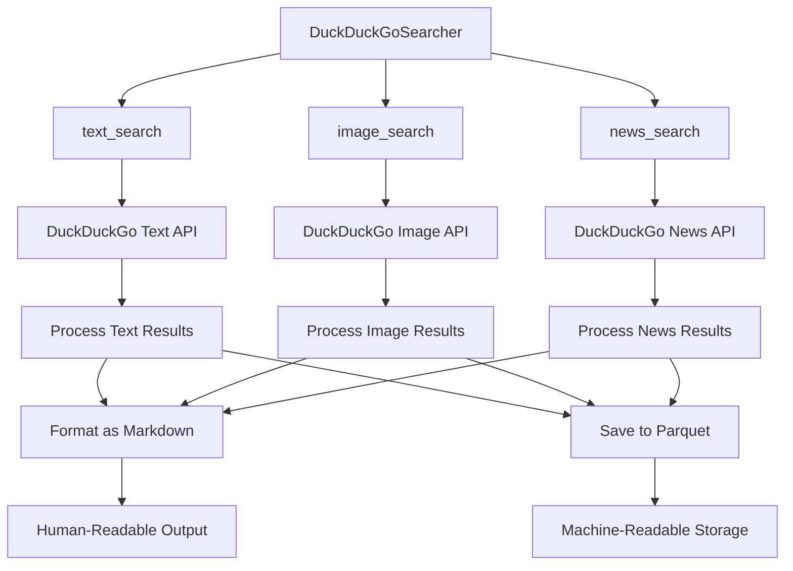

Each search type has specialized processing:
- **Text Search**: Extracts titles, descriptions, and URLs
- **Image Search**: Handles image URLs, thumbnails, and source information
- **News Search**: Captures publication dates, sources, and summaries

### 4.3 Result Processing

The result processing pipeline ensures consistent handling across search types:

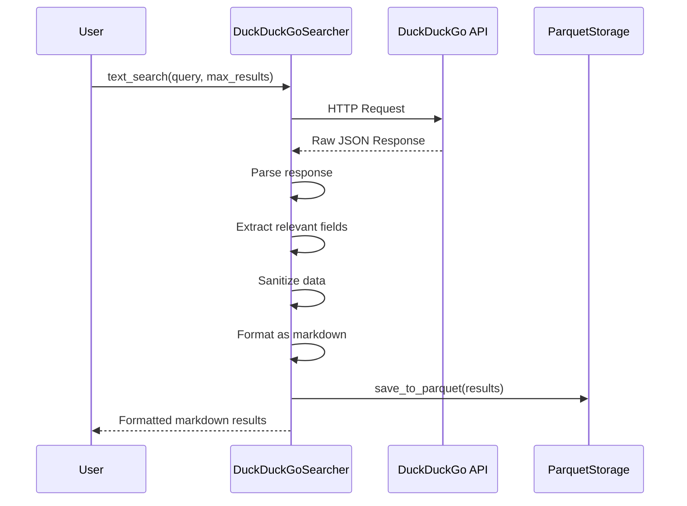

Result processing includes:
- Sanitization of input and output
- Consistent field extraction
- Handling of special characters
- Removal of duplicate results
- Limiting to requested result count
- Both human and machine-readable outputs

### 4.4 Privacy Considerations

The DuckDuckGoSearcher is designed with privacy in mind:

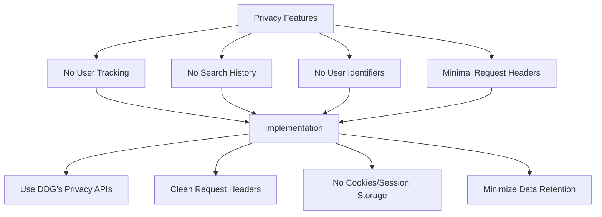

These features ensure:
- No personal data is collected
- Searches are not linked to user identity
- Minimal tracking information is transmitted
- Results are as anonymous as possible

## 5. BeautifulSoup Web Crawler

The BSWebCrawler provides robust web page analysis and content extraction capabilities using the BeautifulSoup library.

### 5.1 Architecture

The BSWebCrawler is implemented as a class with both instance methods and static utility methods:

```mermaid
classDiagram
    class BSWebCrawler {
        -data_dir: str
        +__init__(data_dir)
        +fetch_url_content(url) str
        +extract_text_from_html(html) str
        +extract_pypi_content(html, package_name) Dict
        +extract_documentation_content(html, url) Dict
        +format_pypi_info(package_data) str
        +format_documentation(doc_data) str
        +crawl_documentation_site(url) str
        -_clean_html(html) str
        -_extract_code_blocks(soup) List
    }
    
    BSWebCrawler --> "aiohttp.ClientSession"
    BSWebCrawler --> "bs4.BeautifulSoup"
    BSWebCrawler --> "ParquetStorage"
```

The module combines:
- Asynchronous HTTP requests via aiohttp
- HTML parsing with BeautifulSoup
- Content extraction algorithms
- Specialized extractors for specific content types
- Markdown formatting for readable output

### 5.2 Content Extraction

The general content extraction process follows these steps:

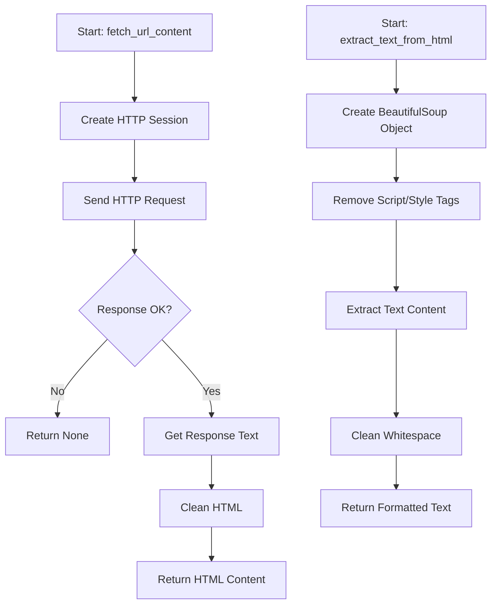

Key implementation details:
- Handles different HTTP status codes appropriately
- Sets proper user-agent and headers to avoid blocking
- Manages connection timeouts and retries
- Removes irrelevant HTML elements (scripts, styles, etc.)
- Preserves important structural elements (paragraphs, headings)

### 5.3 Specialized Extractors

The BSWebCrawler includes specialized extractors for specific content types:

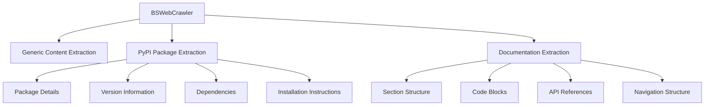

Each specialized extractor is tailored to the specific structure and semantics of its target content type:

1. **PyPI Package Extraction**:
   - Extracts version, author, and license information
   - Identifies installation commands
   - Extracts dependency lists
   - Captures project description and documentation links

2. **Documentation Extraction**:
   - Identifies section hierarchy
   - Extracts code examples with language detection
   - Preserves structure and formatting
   - Handles cross-references and links

### 5.4 Document Formatting

The BSWebCrawler provides consistent document formatting capabilities:

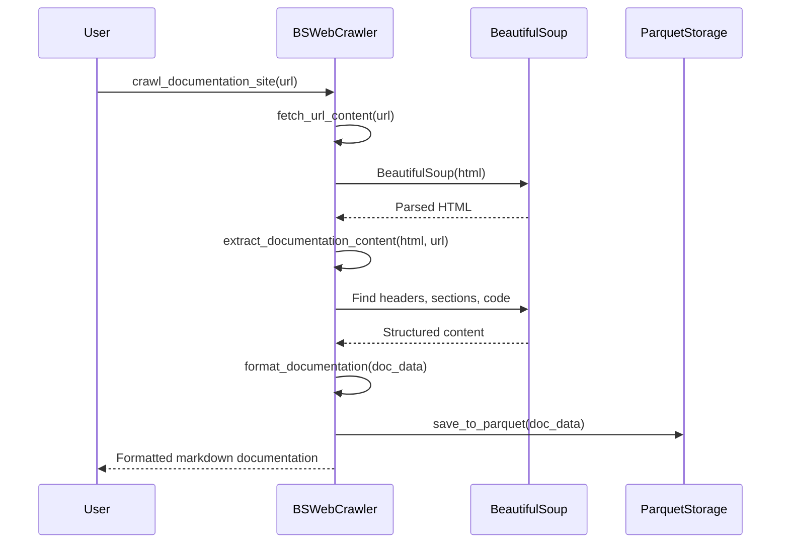

The document formatting:
- Creates consistent hierarchical structures
- Applies syntax highlighting to code blocks
- Preserves links with proper formatting
- Generates tables of contents for complex documents
- Formats metadata consistently
- Produces clean, readable markdown output

## 6. ArXiv Fetcher

The ArxivFetcher provides specialized capabilities for retrieving and processing academic papers from the arXiv repository.

### 6.1 Architecture

The ArxivFetcher is implemented as a class with methods for different aspects of arXiv paper retrieval:

```mermaid
classDiagram
    class ArxivFetcher {
        -data_dir: str
        +__init__(data_dir)
        +extract_arxiv_id(url_or_id) str
        +fetch_paper_info(arxiv_id) Dict
        +download_source(arxiv_id) Dict
        +fetch_paper_with_latex(arxiv_id) Dict
        +format_paper_for_learning(paper_info) str
        -_extract_metadata_from_xml(response) Dict
        -_find_main_tex_file(source_dir) str
        -_extract_latex_from_tarball(file_path, target_dir) Dict
    }
    
    ArxivFetcher --> "aiohttp.ClientSession"
    ArxivFetcher --> "tarfile"
    ArxivFetcher --> "xml.etree.ElementTree"
    ArxivFetcher --> "ParquetStorage"
```

The ArxivFetcher combines:
- arXiv API queries for metadata
- Direct tarball download for LaTeX source
- XML parsing for metadata extraction
- LaTeX file analysis and processing
- Parquet storage for data persistence

### 6.2 Metadata Extraction

The metadata extraction process retrieves comprehensive paper information:

```mermaid
flowchart TD
    A[Start: fetch_paper_info] --> B[Validate arXiv ID]
    B --> C[Construct API URL]
    C --> D[Send API Request]
    D --> E{Response OK?}
    E -->|No| F[Return Error]
    E -->|Yes| G[Parse XML Response]
    G --> H[Extract Paper Metadata]
    H --> I[Format Metadata Dict]
    I --> J[Save to Parquet]
    J --> K[Return Metadata]
```

The metadata extraction:
- Retrieves comprehensive metadata including title, authors, abstract, and categories
- Handles different arXiv ID formats
- Parses XML responses cleanly
- Creates structured data dictionaries
- Respects arXiv API rate limits

### 6.3 LaTeX Processing

The LaTeX source processing involves several complex steps:

```mermaid
sequenceDiagram
    participant User
    participant AF as ArxivFetcher
    participant AX as arXiv API
    participant FS as File System
    participant PS as ParquetStorage
    
    User->>AF: download_source(arxiv_id)
    AF->>AF: Validate arXiv ID
    AF->>AX: Construct source URL
    AF->>AX: Download tarball
    AX-->>AF: .tar.gz file
    
    AF->>FS: Create extraction directory
    AF->>AF: Extract tarball
    AF->>FS: Write extracted files
    
    AF->>AF: Identify main LaTeX file
    AF->>FS: Read LaTeX content
    FS-->>AF: LaTeX source
    
    AF->>AF: Process LaTeX
    AF->>PS: Save metadata to Parquet
    
    AF-->>User: Source information
```

Key LaTeX processing features:
- Extracts and organizes all source files
- Identifies the main LaTeX document
- Handles figures and supplementary materials
- Processes bibliographies and references
- Creates a structured representation of the paper source

### 6.4 Combined Workflows

The ArxivFetcher supports combined workflows that integrate multiple operations:

```mermaid
flowchart TD
    A[Start: fetch_paper_with_latex] --> B[Split into Parallel Tasks]
    B --> C[fetch_paper_info]
    B --> D[download_source]
    C --> E[Paper Metadata]
    D --> F[LaTeX Source]
    E --> G[Combine Results]
    F --> G
    G --> H[Create Unified Dictionary]
    H --> I[Save to Parquet]
    I --> J[Return Combined Result]
```

Advanced features include:
- Parallel processing of metadata and source retrieval
- Consistent error handling for partial success scenarios
- Integration of metadata and source content
- Extraction of mathematical formulas
- Creation of learning-friendly paper representations
- Comprehensive paper summaries with key information highlighted

```mermaid
flowchart TD
    A[ArxivFetcher Capabilities] --> B[Metadata Extraction]
    A --> C[LaTeX Source Retrieval]
    A --> D[Combined Workflows]
    A --> E[Learning Format Generation]
    
    B --> F[Title, Authors, Abstract]
    B --> G[Categories & Tags]
    B --> H[Publication Info]
    
    C --> I[Source Code Extraction]
    C --> J[Figure Handling]
    C --> K[Bibliography Processing]
    
    D --> L[Unified Paper Object]
    D --> M[Comprehensive Analysis]
    
    E --> N[Structured Summary]
    E --> O[Key Concept Extraction]
    E --> P[Formula Highlighting]
```

The combined workflows enable comprehensive paper analysis and learning, bringing together both metadata and content for a complete understanding of academic papers.

## 7. Appendix

### 7.1 Glossary of Terms

| Term | Definition |
|------|------------|
| **aiohttp** | Asynchronous HTTP client/server framework for Python used for non-blocking network operations. |
| **API** | Application Programming Interface; a set of rules allowing different software applications to communicate with each other. |
| **Apache Arrow** | Cross-language development platform for in-memory data, providing a standardized columnar memory format. |
| **arXiv API** | Interface for programmatically accessing academic paper metadata and content from the arXiv repository. |
| **Asynchronous Programming** | Programming paradigm that allows operations to execute independently without blocking the main execution thread. |
| **BeautifulSoup** | Python library for parsing HTML and XML documents, facilitating web scraping by navigating and searching the parse tree. |
| **Binary File** | File containing data stored in binary format (non-text), often requiring specialized software to interpret. |
| **Breadth-First Crawling** | Web crawling strategy that explores all links at the current depth before moving to links at the next depth level. |
| **Caption Track** | Text-based representation of the spoken content in a video, often available in multiple languages. |
| **Class Diagram** | UML diagram showing the structure of a system by displaying classes, attributes, methods, and relationships. |
| **Code Similarity** | Measure of how similar two code snippets are based on algorithms like fuzzy matching, tokenization, or semantic analysis. |
| **Columnar Storage** | Data organization method that stores each column separately, optimizing for analytical operations on specific columns. |
| **Crawler** | Software that systematically browses web content and extracts information according to specific rules. |
| **Data Flow Diagram** | Visual representation showing how data moves through a system or process. |
| **Depth-First Crawling** | Web crawling strategy that explores as far as possible along each branch before backtracking. |
| **Documentation Site** | Website containing technical documentation, API references, tutorials, or guides for software products. |
| **DuckDuckGo API** | Interface for programmatically performing web searches through the DuckDuckGo search engine. |
| **Fuzzy Matching** | Algorithm for finding strings that approximately match a pattern, allowing for minor differences. |
| **Git** | Distributed version control system for tracking changes in source code during software development. |
| **GitHub** | Web-based hosting service for version control using Git, providing collaboration features for software projects. |
| **GitPython** | Python library for interacting with Git repositories programmatically. |
| **HTML** | HyperText Markup Language; standard markup language for creating web pages and applications. |
| **JSON** | JavaScript Object Notation; lightweight data-interchange format based on JavaScript object syntax. |
| **LaTeX** | Document preparation system especially suited for scientific and mathematical documentation. |
| **Markdown** | Lightweight markup language designed to be converted to HTML and other formats. |
| **Metadata** | Data that provides information about other data (e.g., video title, author, publication date). |
| **Pandas DataFrame** | Two-dimensional, size-mutable, potentially heterogeneous tabular data structure in Python. |
| **Parquet** | Columnar storage file format designed for efficient data compression and encoding. |
| **Parser** | Software component that analyzes a string of symbols according to formal grammar rules. |
| **Playlist** | Collection of videos grouped together, typically sharing a common theme or creator. |
| **PyPI** | Python Package Index; repository of software packages written in Python. |
| **pytube** | Python library specifically designed for downloading YouTube videos. |
| **Rate Limiting** | Practice of limiting the number of API requests a user can make within a given time period. |
| **Repository** | Central location where data, typically code, is stored and managed. |
| **Robots.txt** | Text file used by websites to communicate with web crawlers about which areas should not be processed or scanned. |
| **Schema** | Formal description of the structure and constraints of data, defining how data is organized. |
| **Schema Evolution** | Process of making changes to a data schema over time while maintaining backward compatibility. |
| **Sequence Diagram** | UML diagram showing the order of interactions between objects over time. |
| **Serialization** | Process of converting an object into a format that can be stored or transmitted. |
| **SRT** | SubRip Text; file format for subtitle files that includes timing information. |
| **Tarball** | Archive file format that combines multiple files into a single file (often with .tar.gz extension). |
| **Tokenization** | Process of breaking text into meaningful units (tokens) such as words or phrases. |
| **User-Agent** | String identifying the browser and operating system to web servers, used by crawlers to identify themselves. |
| **Web Scraping** | Extracting data from websites by parsing the HTML structure. |
| **XML** | Extensible Markup Language; markup language that defines rules for encoding documents in a format that is both human and machine-readable. |
| **YouTube Data API** | Set of interfaces provided by Google for programmatically interacting with YouTube content. |
