# OARC-Crawlers: Components and Implementations

This document provides in-depth explanations of the various crawlers and components in the OARC-Crawlers framework, including architecture overviews, data flow diagrams, implementation details, and advanced usage patterns.

## Table of Contents
- [1. Parquet Storage](#1-parquet-storage)
  - [1.1 Architecture](#11-architecture)
  - [1.2 Data Flow](#12-data-flow)
  - [1.3 Advanced Usage](#13-advanced-usage)
  - [1.4 Schema Management](#14-schema-management)
- [2. YouTube Crawler](#2-youtube-crawler)
  - [2.1 Architecture](#21-architecture)
  - [2.2 Video Download Process](#22-video-download-process)
  - [2.3 Playlist Handling](#23-playlist-handling)
  - [2.4 Caption Extraction](#24-caption-extraction)
  - [2.5 Search Functionality](#25-search-functionality)
- [3. GitHub Crawler](#3-github-crawler)
  - [3.1 Architecture](#31-architecture)
  - [3.2 Repository Processing](#32-repository-processing)
  - [3.3 Code Analysis & Summary](#33-code-analysis--summary)
  - [3.4 Similarity Detection](#34-similarity-detection)
  - [3.5 Natural Language Querying](#35-natural-language-querying)
- [4. DuckDuckGo Crawler](#4-duckduckgo-crawler)
  - [4.1 Architecture](#41-architecture)
  - [4.2 Search Types](#42-search-types)
  - [4.3 Result Processing](#43-result-processing)
  - [4.4 Privacy Considerations](#44-privacy-considerations)
- [5. Web Crawler](#5-web-crawler)
  - [5.1 Architecture](#51-architecture)
  - [5.2 Content Extraction](#52-content-extraction)
  - [5.3 Specialized Extractors (PyPI, Docs)](#53-specialized-extractors-pypi-docs)
  - [5.4 Document Formatting](#54-document-formatting)
- [6. ArXiv Crawler](#6-arxiv-crawler)
  - [6.1 Architecture](#61-architecture)
  - [6.2 Metadata Extraction](#62-metadata-extraction)
  - [6.3 LaTeX Source Processing](#63-latex-source-processing)
  - [6.4 Combined Workflows](#64-combined-workflows)
- [7. Appendix](#7-appendix)
  - [7.1 Glossary of Terms](#71-glossary-of-terms)
- [See Also](#see-also)

## 1. Parquet Storage

*Component providing unified data persistence.*

The `ParquetStorage` component uses `pyarrow` for working with Parquet files and serves as a standardized interface for saving, loading, and appending structured data across all OARC-Crawlers modules.

```python
from oarc_crawlers import ParquetStorage

# Example usage
data = {'id': 1, 'value': 100}
ParquetStorage.save_to_parquet(data, 'data.parquet')
df = ParquetStorage.load_from_parquet('data.parquet')
```

Key features:
- Handles dictionary, list, and DataFrame inputs 
- Safe error handling with fallbacks
- Schema evolution support
- Built-in compression options
- Directory creation as needed

### 1.1 Architecture

`ParquetStorage` is typically implemented as a utility class or module containing static methods. It abstracts the underlying `pyarrow` library interactions.

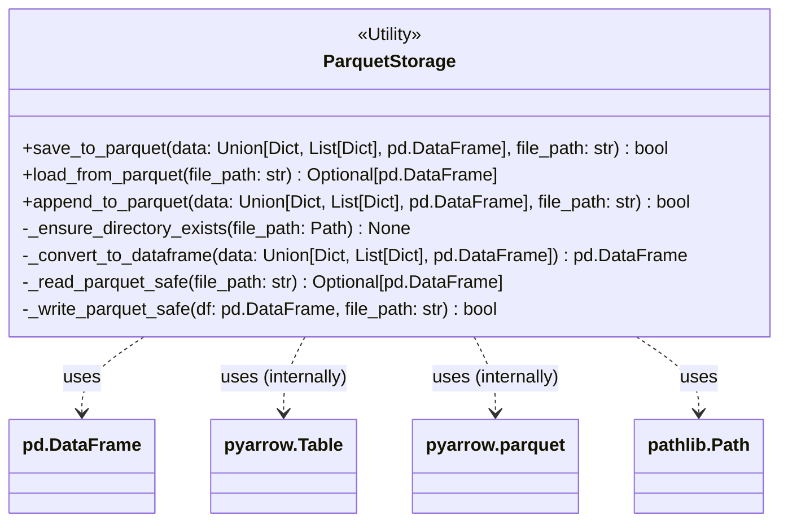
```mermaid
classDiagram
    class ParquetStorage {
        <<Utility>>
        +save_to_parquet(data: Union[Dict, List[Dict], pd.DataFrame], file_path: str) bool
        +load_from_parquet(file_path: str) Optional[pd.DataFrame]
        +append_to_parquet(data: Union[Dict, List[Dict], pd.DataFrame], file_path: str) bool
        -_ensure_directory_exists(file_path: Path) None
        -_convert_to_dataframe(data: Union[Dict, List[Dict], pd.DataFrame]) pd.DataFrame
        -_read_parquet_safe(file_path: str) Optional[pd.DataFrame]
        -_write_parquet_safe(df: pd.DataFrame, file_path: str) bool
    }

    ParquetStorage ..> pd.DataFrame : uses
    ParquetStorage ..> pyarrow.Table : uses (internally)
    ParquetStorage ..> pyarrow.parquet : uses (internally)
    ParquetStorage ..> pathlib.Path : uses
```

Key responsibilities:
- Handling input data types (Dict, List[Dict], DataFrame).
- Converting inputs to Pandas DataFrames.
- Managing file paths and directory creation.
- Interfacing with `pyarrow` for read/write operations.
- Implementing safe read/write logic (error handling).
- Handling schema evolution during appends.

### 1.2 Data Flow

The typical data flow for saving data involves normalization and serialization:

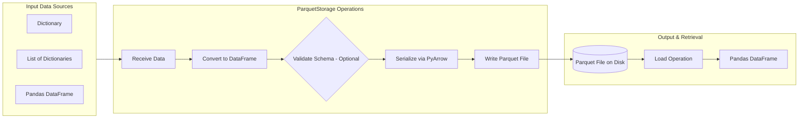
```mermaid
graph LR
    subgraph InputSources [Input Data Sources]
        direction LR
        InputDict[Dictionary]
        InputList[List of Dictionaries]
        InputDF[Pandas DataFrame]
    end

    subgraph ParquetStorageProcess [ParquetStorage Operations]
        direction TB
        A[Receive Data] --> B[Convert to DataFrame]
        B --> C{Validate Schema - Optional}
        C --> D[Serialize via PyArrow]
        D --> E[Write Parquet File]
    end

    subgraph OutputData [Output & Retrieval]
        direction LR
        ParquetFile[(Parquet File on Disk)] --> LoadOp[Load Operation]
        LoadOp --> OutputDF[Pandas DataFrame]
    end

    InputSources --> A
    E --> ParquetFile
```

This ensures that regardless of the crawler module, the output data is consistently stored in the efficient, columnar Parquet format.

### 1.3 Advanced Usage

`ParquetStorage` incorporates features for robust data handling:

1.  **Schema Evolution**: The `append_to_parquet` method intelligently handles schema differences between the existing file and the new data. It typically aligns columns by name, adding nulls where columns don't exist in one of the datasets, thus allowing schemas to evolve over time without breaking the append operation.
2.  **Automatic Type Conversion**: Python types (int, float, str, bool, datetime, lists, dicts) within the input data are automatically mapped to appropriate `pyarrow`/Parquet types during serialization. Nested structures are often stored as JSON strings or using Parquet's nested types if the schema allows.
3.  **Fault Tolerance**: `load_from_parquet` is designed to be resilient. It returns `None` and logs errors for common issues like file not found, permission errors, or corrupted files, preventing crashes in the calling crawler code.
4.  **Directory Management**: `save_to_parquet` and `append_to_parquet` automatically create the necessary parent directories for the specified `file_path`, simplifying usage for crawler modules.

Example of schema evolution during append:
```python
# Initial save
ParquetStorage.save_to_parquet({'id': 1, 'value': 100}, 'data.parquet')
# Append data with new column 'category' and missing 'value'
ParquetStorage.append_to_parquet({'id': 2, 'category': 'A'}, 'data.parquet')
# Load combined data
df = ParquetStorage.load_from_parquet('data.parquet')
# df will contain:
#    id  value category
# 0   1  100.0     None
# 1   2    NaN        A
```

### 1.4 Schema Management

While Parquet files inherently store their schema, `ParquetStorage` can optionally integrate with explicit schema definitions (e.g., `pyarrow.Schema`) for validation before writing.

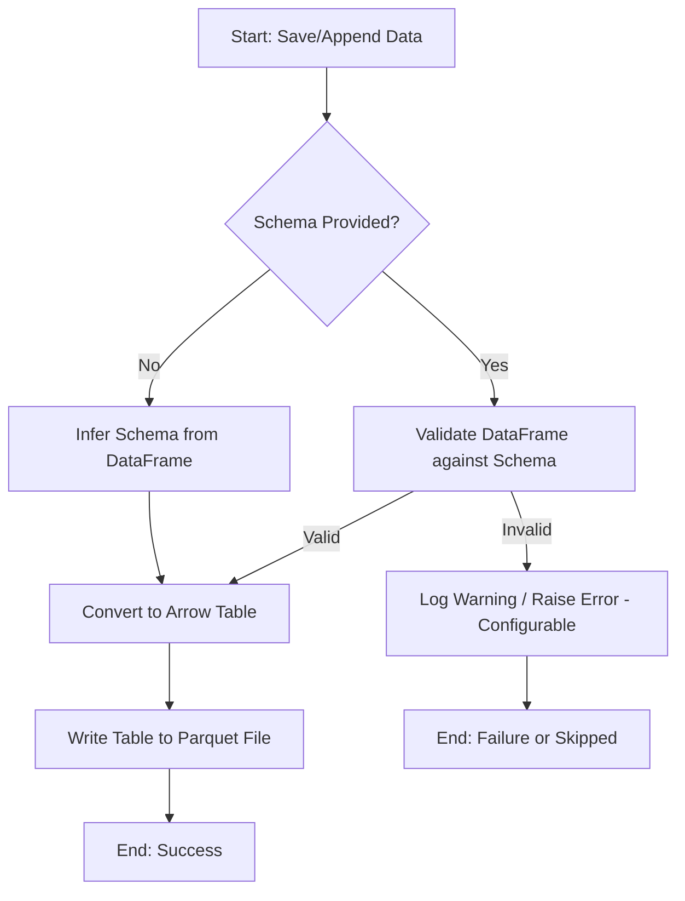
```mermaid
graph TD
    A[Start: Save/Append Data] --> B{Schema Provided?}
    B -- Yes --> C[Validate DataFrame against Schema]
    B -- No --> D[Infer Schema from DataFrame]
    C -- Valid --> E[Convert to Arrow Table]
    C -- Invalid --> F[Log Warning / Raise Error - Configurable]
    D --> E
    E --> G[Write Table to Parquet File]
    G --> H[End: Success]
    F --> I[End: Failure or Skipped]
```

Enforcing schemas ensures data consistency, especially in long-running data collection projects or when multiple processes write to the same datasets.

## 2. YouTube Crawler

*Component for interacting with YouTube.*

The `YouTubeCrawler` module provides functionalities for downloading videos and playlists, extracting captions, and searching for videos on YouTube.

### 2.1 Architecture

Implemented as an asynchronous class, leveraging external libraries for YouTube interaction.

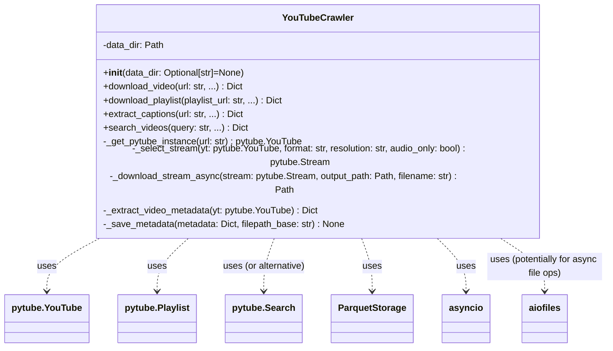
```mermaid
classDiagram
    class YouTubeCrawler {
        -data_dir: Path
        +__init__(data_dir: Optional[str]=None)
        +download_video(url: str, ...) Dict
        +download_playlist(playlist_url: str, ...) Dict
        +extract_captions(url: str, ...) Dict
        +search_videos(query: str, ...) Dict
        -_get_pytube_instance(url: str) pytube.YouTube
        -_select_stream(yt: pytube.YouTube, format: str, resolution: str, audio_only: bool) pytube.Stream
        -_download_stream_async(stream: pytube.Stream, output_path: Path, filename: str) Path
        -_extract_video_metadata(yt: pytube.YouTube) Dict
        -_save_metadata(metadata: Dict, filepath_base: str) None
    }

    YouTubeCrawler ..> pytube.YouTube : uses
    YouTubeCrawler ..> pytube.Playlist : uses
    YouTubeCrawler ..> pytube.Search : uses (or alternative)
    YouTubeCrawler ..> ParquetStorage : uses
    YouTubeCrawler ..> asyncio : uses
    YouTubeCrawler ..> aiofiles : uses (potentially for async file ops)
```

Key aspects:
- Asynchronous methods (`async def`) for non-blocking I/O.
- Uses `pytube` (or similar) for core YouTube interactions.
- Integrates `ParquetStorage` for saving metadata and results.
- Manages file paths and downloads within the configured `data_dir`.
- Provides structured dictionary outputs summarizing operations.

### 2.2 Video Download Process

Downloading a single video involves fetching info, selecting a stream, downloading, and saving metadata.

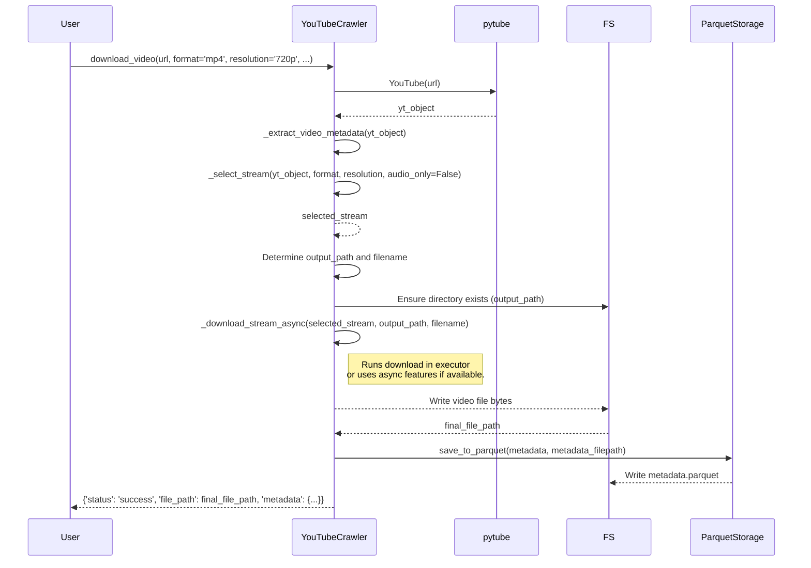
```mermaid
sequenceDiagram
    participant User
    participant YTD as YouTubeCrawler
    participant PytubeLib as pytube
    participant FileSystem as FS
    participant ParquetStore as ParquetStorage

    User->>YTD: download_video(url, format='mp4', resolution='720p', ...)
    YTD->>PytubeLib: YouTube(url)
    PytubeLib-->>YTD: yt_object
    YTD->>YTD: _extract_video_metadata(yt_object)
    YTD->>YTD: _select_stream(yt_object, format, resolution, audio_only=False)
    YTD-->>YTD: selected_stream
    YTD->>YTD: Determine output_path and filename
    YTD->>FileSystem: Ensure directory exists (output_path)
    YTD->>YTD: _download_stream_async(selected_stream, output_path, filename)
    Note right of YTD: Runs download in executor<br/>or uses async features if available.
    YTD-->>FileSystem: Write video file bytes
    FileSystem-->>YTD: final_file_path
    YTD->>ParquetStore: save_to_parquet(metadata, metadata_filepath)
    ParquetStore-->>FileSystem: Write metadata.parquet
    YTD-->>User: {'status': 'success', 'file_path': final_file_path, 'metadata': {...}}
```

Implementation details:
- Stream selection logic prioritizes user requests but falls back to available options.
- Audio extraction might involve post-processing with `ffmpeg` (requiring it as a dependency/external tool).
- Downloads are performed asynchronously, often using `asyncio.to_thread` or similar if the underlying library is synchronous.
- Metadata (title, author, duration, views, publish date, etc.) is saved alongside the video file.

### 2.3 Playlist Handling

Downloading playlists involves iterating through videos, handling each individually while managing overall progress.

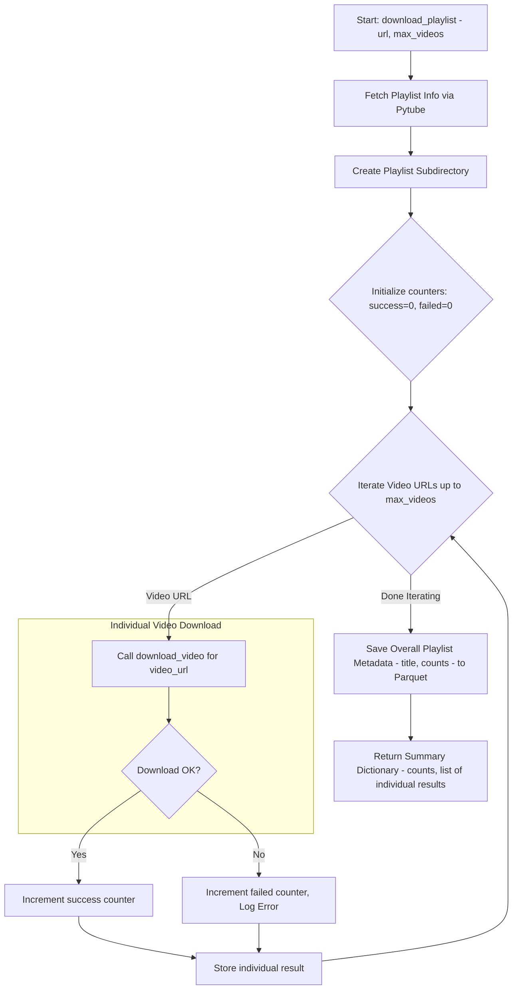
```mermaid
graph TD
    A[Start: download_playlist - url, max_videos] --> B[Fetch Playlist Info via Pytube]
    B --> C[Create Playlist Subdirectory]
    C --> D{Initialize counters: success=0, failed=0}
    D --> E{Iterate Video URLs up to max_videos}
    E -- Video URL --> F[Call download_video for video_url]
    subgraph Individual Video Download
        F --> G{Download OK?}
    end
    G -- Yes --> H[Increment success counter]
    G -- No --> I[Increment failed counter, Log Error]
    H --> J[Store individual result]
    I --> J
    J --> E
    E -- Done Iterating --> K[Save Overall Playlist Metadata - title, counts - to Parquet]
    K --> L[Return Summary Dictionary - counts, list of individual results]
```

Key points:
- Sequential processing (or limited concurrency) is often used to avoid rate-limiting.
- Errors in downloading one video do not stop the entire playlist download.
- Results provide both an overall summary and details for each video attempt.
- Files are organized within a dedicated playlist subdirectory.

### 2.4 Caption Extraction

Fetching captions involves checking availability and retrieving specific language tracks.

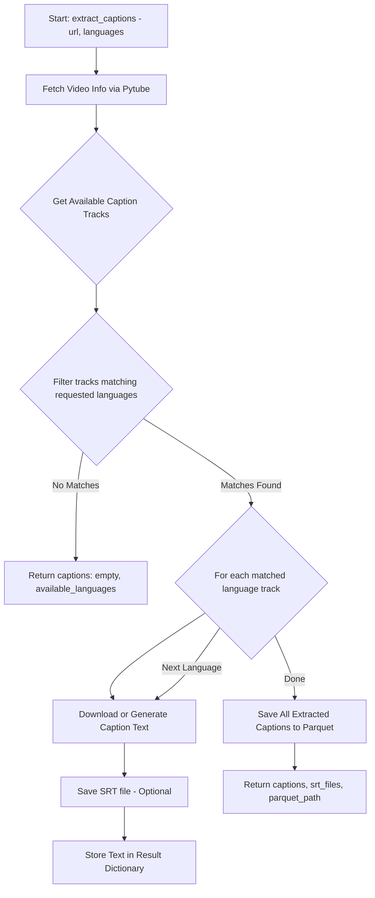
```mermaid
graph TD
    A[Start: extract_captions - url, languages] --> B[Fetch Video Info via Pytube]
    B --> C{Get Available Caption Tracks}
    C --> D{Filter tracks matching requested languages}
    D -- No Matches --> E[Return captions: empty, available_languages]
    D -- Matches Found --> F{For each matched language track}
    F --> G[Download or Generate Caption Text]
    G --> H[Save SRT file - Optional]
    H --> I[Store Text in Result Dictionary]
    F -- Next Language --> G
    F -- Done --> J[Save All Extracted Captions to Parquet]
    J --> K[Return captions, srt_files, parquet_path]
```

Implementation details:
- Uses `pytube`'s caption functionality.
- Handles cases where no captions or no requested languages are available.
- Can save captions as both raw SRT files and cleaned text content.
- Stores structured caption data (language, text) in Parquet.

### 2.5 Search Functionality

Searching YouTube involves querying an API or library and processing the results.

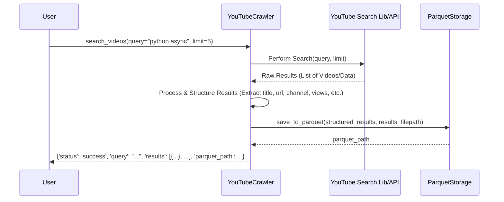
```mermaid
sequenceDiagram
    participant User
    participant YTD as YouTubeCrawler
    participant SearchLib as YouTube Search Lib/API
    participant ParquetStore as ParquetStorage

    User->>YTD: search_videos(query="python async", limit=5)
    YTD->>SearchLib: Perform Search(query, limit)
    SearchLib-->>YTD: Raw Results (List of Videos/Data)
    YTD->>YTD: Process & Structure Results (Extract title, url, channel, views, etc.)
    YTD->>ParquetStore: save_to_parquet(structured_results, results_filepath)
    ParquetStore-->>YTD: parquet_path
    YTD-->>User: {'status': 'success', 'query': "...", 'results': [{...}, ...], 'parquet_path': ...}
```

Key points:
- May use official YouTube Data API (requires key, quota management) or scraping libraries (less stable).
- Extracts relevant metadata for each video result.
- Provides results in both a structured list and saves them to Parquet.

## 3. GitHub Crawler

*Component for interacting with GitHub repositories.*

The `GitHubCrawler` clones repositories, processes their file contents, and provides analysis features like summarization and code search.

### 3.1 Architecture

An asynchronous class using `GitPython` and `PyGitHub`for Git operations and potentially other libraries for analysis.

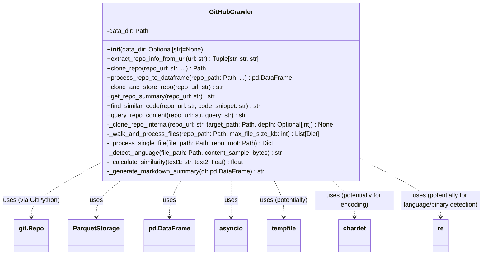
```mermaid
classDiagram
    class GitHubCrawler {
        -data_dir: Path
        +__init__(data_dir: Optional[str]=None)
        +extract_repo_info_from_url(url: str) Tuple[str, str, str]
        +clone_repo(repo_url: str, ...) Path
        +process_repo_to_dataframe(repo_path: Path, ...) pd.DataFrame
        +clone_and_store_repo(repo_url: str) str
        +get_repo_summary(repo_url: str) str
        +find_similar_code(repo_url: str, code_snippet: str) str
        +query_repo_content(repo_url: str, query: str) str
        -_clone_repo_internal(repo_url: str, target_path: Path, depth: Optional[int]) None
        -_walk_and_process_files(repo_path: Path, max_file_size_kb: int) List[Dict]
        -_process_single_file(file_path: Path, repo_root: Path) Dict
        -_detect_language(file_path: Path, content_sample: bytes) str
        -_calculate_similarity(text1: str, text2: float) float
        -_generate_markdown_summary(df: pd.DataFrame) str
    }

    GitHubCrawler ..> git.Repo : uses (via GitPython)
    GitHubCrawler ..> ParquetStorage : uses
    GitHubCrawler ..> pd.DataFrame : uses
    GitHubCrawler ..> asyncio : uses
    GitHubCrawler ..> tempfile : uses (potentially)
    GitHubCrawler ..> chardet : uses (potentially for encoding)
    GitHubCrawler ..> re : uses (potentially for language/binary detection)
```

Key aspects:
- Asynchronous methods for network/disk I/O.
- Uses `GitPython` for cloning and potentially other Git operations.
- Relies on `ParquetStorage` for saving processed repository data.
- Manages temporary directories for cloning.
- Implements file processing logic (language detection, metadata extraction).
- Provides higher-level analysis functions.

### 3.2 Repository Processing

Transforming a cloned repository into a structured DataFrame involves walking the file tree and processing each file.

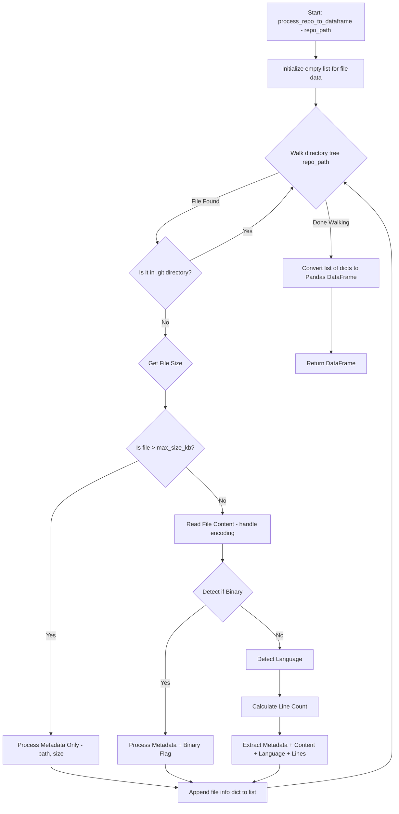
```mermaid
graph TD
    A[Start: process_repo_to_dataframe - repo_path] --> B[Initialize empty list for file data]
    B --> C{Walk directory tree repo_path}
    C -- File Found --> D{Is it in .git directory?}
    D -- Yes --> C
    D -- No --> E{Get File Size}
    E --> F{Is file > max_size_kb?}
    F -- Yes --> G[Process Metadata Only - path, size]
    F -- No --> H[Read File Content - handle encoding]
    H --> I{Detect if Binary}
    I -- Yes --> J[Process Metadata + Binary Flag]
    I -- No --> K[Detect Language]
    K --> L[Calculate Line Count]
    L --> M[Extract Metadata + Content + Language + Lines]
    G --> N[Append file info dict to list]
    J --> N
    M --> N
    N --> C
    C -- Done Walking --> O[Convert list of dicts to Pandas DataFrame]
    O --> P[Return DataFrame]
```

Implementation details:
- Skips the `.git` directory.
- Handles file reading errors (permissions, encoding) gracefully for individual files.
- Uses heuristics (file extensions, content analysis like checking for null bytes) for binary detection.
- Uses libraries or mappings for language detection.
- Stores file content only for non-binary files below the size threshold.

### 3.3 Code Analysis & Summary

Generating a repository summary involves analyzing the processed file data.

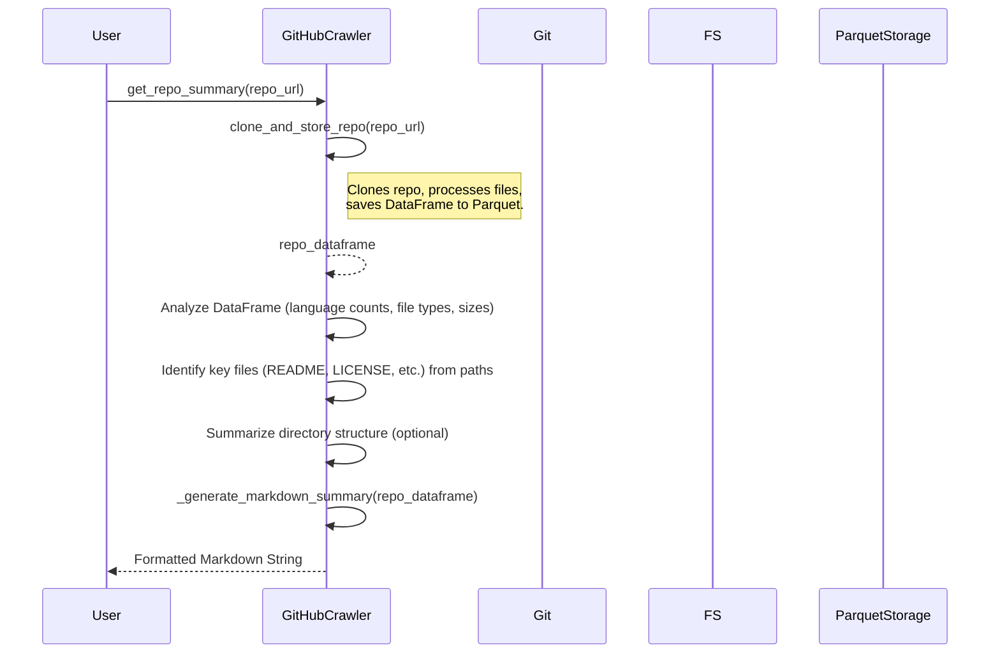
```mermaid
sequenceDiagram
    participant User
    participant GC as GitHubCrawler
    participant GitPython as Git
    participant FileSystem as FS
    participant ParquetStore as ParquetStorage

    User->>GC: get_repo_summary(repo_url)
    GC->>GC: clone_and_store_repo(repo_url) # Or load cached data
    Note right of GC: Clones repo, processes files,<br/>saves DataFrame to Parquet.
    GC-->>GC: repo_dataframe
    GC->>GC: Analyze DataFrame (language counts, file types, sizes)
    GC->>GC: Identify key files (README, LICENSE, etc.) from paths
    GC->>GC: Summarize directory structure (optional)
    GC->>GC: _generate_markdown_summary(repo_dataframe)
    GC-->>User: Formatted Markdown String
```

The summary typically includes:
- Basic repo info (name, owner).
- Language distribution (e.g., Python 60%, JS 20%, HTML 10%).
- Total file count, total lines of code (estimated).
- Presence/absence of key files (README, LICENSE, CONTRIBUTING).
- Overview of top-level directories.

### 3.4 Similarity Detection

Finding similar code involves comparing the input snippet against the content of files in the repository.

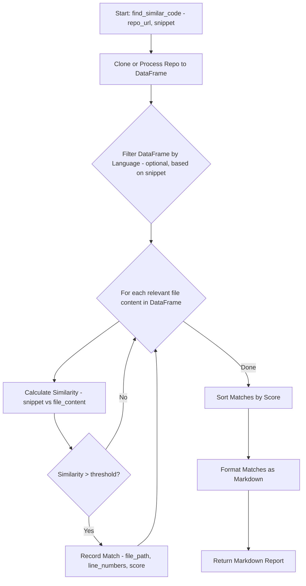
```mermaid
graph TD
    A[Start: find_similar_code - repo_url, snippet] --> B[Clone or Process Repo to DataFrame]
    B --> C{Filter DataFrame by Language - optional, based on snippet}
    C --> D{For each relevant file content in DataFrame}
    D --> E[Calculate Similarity - snippet vs file_content]
    E --> F{Similarity > threshold?}
    F -- Yes --> G[Record Match - file_path, line_numbers, score]
    F -- No --> D
    G --> D
    D -- Done --> H[Sort Matches by Score]
    H --> I[Format Matches as Markdown]
    I --> J[Return Markdown Report]

    %% Note: Uses fuzzy matching, token-based diff, or other similarity algorithms.
```

Key points:
- Leverages the processed repository DataFrame.
- Uses string similarity algorithms (e.g., `difflib.SequenceMatcher`, Levenshtein distance) or potentially more advanced methods.
- Filters results based on a similarity threshold.
- Formats output clearly, showing context (file, lines) for each match.

### 3.5 Natural Language Querying

Answering natural language questions about code requires deeper semantic understanding, often involving LLMs or specialized code search indexes.

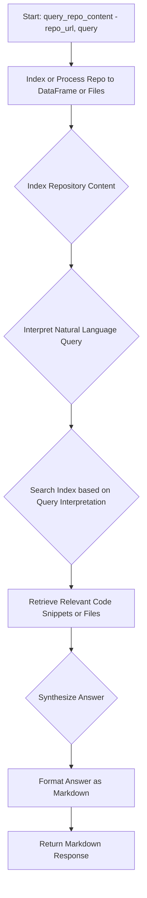
```mermaid
graph TD
    A[Start: query_repo_content - repo_url, query] --> B[Index or Process Repo to DataFrame or Files]
    B --> C{Index Repository Content}
    C --> D{Interpret Natural Language Query}
    D --> E{Search Index based on Query Interpretation}
    E --> F[Retrieve Relevant Code Snippets or Files]
    F --> G{Synthesize Answer}
    G --> H[Format Answer as Markdown]
    H --> I[Return Markdown Response]

    %% Explanatory notes (not nodes)
    %% Note: Indexing may involve creating embeddings, keyword index, or preparing context for LLM.
    %% Note: Synthesis may involve feeding retrieved context and query to an LLM.
```

Implementation notes:
- This is complex and relies heavily on the chosen indexing and search/synthesis strategy.
- Could use vector databases (e.g., ChromaDB, FAISS) with code embeddings (e.g., from Sentence Transformers or code-specific models).
- Could involve prompting an LLM with the query and relevant code context retrieved via simpler search methods first.
- Error handling needs to manage failures in indexing, search, or LLM interaction.

## 4. DuckDuckGo Searcher

*Component for performing web searches via DuckDuckGo.*

Provides a privacy-respecting interface to DuckDuckGo's search capabilities (text, images, news).

### 4.1 Architecture

An asynchronous class using HTTP requests to interact with DuckDuckGo.

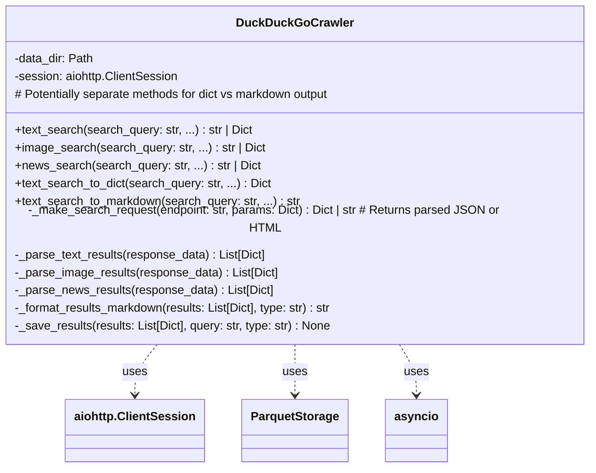
```mermaid
classDiagram
    class DuckDuckGoCrawler {
        -data_dir: Path
        -session: aiohttp.ClientSession
        +text_search(search_query: str, ...) str | Dict
        +image_search(search_query: str, ...) str | Dict
        +news_search(search_query: str, ...) str | Dict
        # Potentially separate methods for dict vs markdown output
        +text_search_to_dict(search_query: str, ...) Dict
        +text_search_to_markdown(search_query: str, ...) str
        -_make_search_request(endpoint: str, params: Dict) Dict | str # Returns parsed JSON or HTML
        -_parse_text_results(response_data) List[Dict]
        -_parse_image_results(response_data) List[Dict]
        -_parse_news_results(response_data) List[Dict]
        -_format_results_markdown(results: List[Dict], type: str) str
        -_save_results(results: List[Dict], query: str, type: str) None
    }

    DuckDuckGoCrawler ..> aiohttp.ClientSession : uses
    DuckDuckGoCrawler ..> ParquetStorage : uses
    DuckDuckGoCrawler ..> asyncio : uses
```

Key aspects:
- Uses `aiohttp` for asynchronous requests.
- Interacts with DuckDuckGo endpoints (official API if available, or HTML/JS endpoints).
- Parses search result pages (HTML) or JSON responses.
- Formats results into Markdown or structured dictionaries.
- Saves structured results using `ParquetStorage`.

### 4.2 Search Types

Supports distinct search modalities:

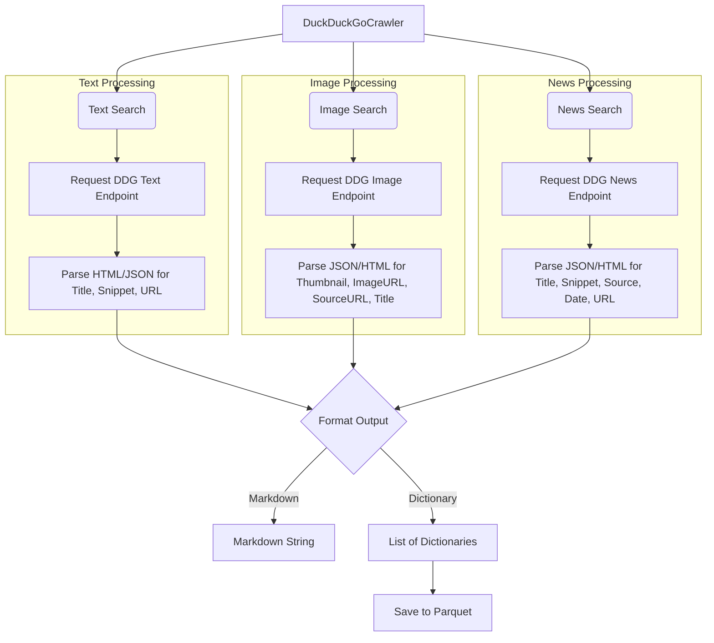
```mermaid
graph TB
    A[DuckDuckGoCrawler] --> B(Text Search)
    A --> C(Image Search)
    A --> D(News Search)

    subgraph Text Processing
        B --> E[Request DDG Text Endpoint]
        E --> F[Parse HTML/JSON for Title, Snippet, URL]
    end
    subgraph Image Processing
        C --> G[Request DDG Image Endpoint]
        G --> H[Parse JSON/HTML for Thumbnail, ImageURL, SourceURL, Title]
    end
    subgraph News Processing
        D --> I[Request DDG News Endpoint]
        I --> J[Parse JSON/HTML for Title, Snippet, Source, Date, URL]
    end

    F --> K{Format Output}
    H --> K
    J --> K

    K -- Markdown --> L[Markdown String]
    K -- Dictionary --> M[List of Dictionaries]

    M --> N[Save to Parquet]
```

Each type requires specific parsing logic tailored to the structure of DuckDuckGo's results for that type.

### 4.3 Result Processing

A pipeline for fetching, parsing, formatting, and storing results.

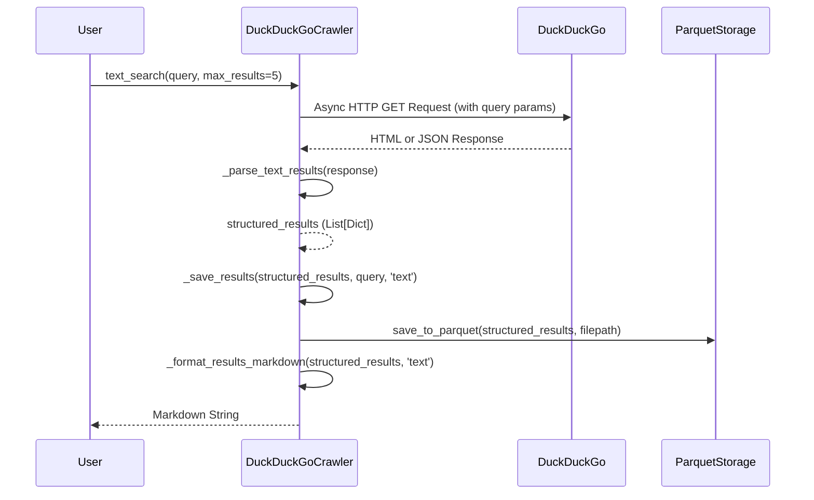
```mermaid
sequenceDiagram
    participant User
    participant DDGS as DuckDuckGoCrawler
    participant DDGEndpoints as DuckDuckGo
    participant ParquetStore as ParquetStorage

    User->>DDGS: text_search(query, max_results=5) # Or _to_dict / _to_markdown
    DDGS->>DDGEndpoints: Async HTTP GET Request (with query params)
    DDGEndpoints-->>DDGS: HTML or JSON Response
    DDGS->>DDGS: _parse_text_results(response)
    DDGS-->>DDGS: structured_results (List[Dict])
    DDGS->>DDGS: _save_results(structured_results, query, 'text')
    DDGS->>ParquetStore: save_to_parquet(structured_results, filepath)
    DDGS->>DDGS: _format_results_markdown(structured_results, 'text') # If markdown requested
    DDGS-->>User: Markdown String # Or Dict if _to_dict called
```

Key steps:
- Constructing the correct URL and parameters for the search type.
- Making the asynchronous HTTP request.
- Parsing the response (handling potential HTML scraping or JSON parsing).
- Extracting relevant fields for each result item.
- Storing the structured data via `ParquetStorage`.
- Formatting the data into the requested output format (Markdown or Dict).

### 4.4 Privacy Considerations

Leverages DuckDuckGo's privacy focus:

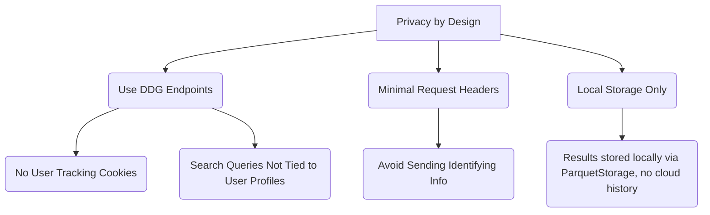
```mermaid
graph TD
    A[Privacy by Design] --> B(Use DDG Endpoints)
    B --> C(No User Tracking Cookies)
    B --> D(Search Queries Not Tied to User Profiles)
    A --> E(Minimal Request Headers)
    E --> F(Avoid Sending Identifying Info)
    A --> G(Local Storage Only)
    G --> H(Results stored locally via ParquetStorage, no cloud history)
```

The component aims to inherit DDG's privacy benefits by using its services appropriately and not adding its own tracking mechanisms.

## 5. BeautifulSoup Web Crawler

*Component for general web page fetching and parsing.*

Uses `aiohttp` for fetching and `BeautifulSoup` for parsing HTML content, with specialized extractors for common site types.

### 5.1 Architecture

An asynchronous class combining HTTP requests and HTML parsing.

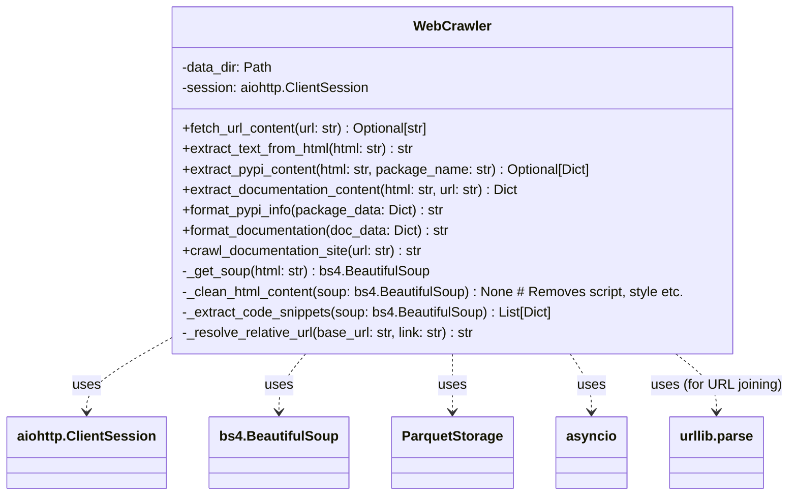
```mermaid
classDiagram
    class WebCrawler {
        -data_dir: Path
        -session: aiohttp.ClientSession
        +fetch_url_content(url: str) Optional[str]
        +extract_text_from_html(html: str) str
        +extract_pypi_content(html: str, package_name: str) Optional[Dict]
        +extract_documentation_content(html: str, url: str) Dict
        +format_pypi_info(package_data: Dict) str
        +format_documentation(doc_data: Dict) str
        +crawl_documentation_site(url: str) str
        -_get_soup(html: str) bs4.BeautifulSoup
        -_clean_html_content(soup: bs4.BeautifulSoup) None # Removes script, style etc.
        -_extract_code_snippets(soup: bs4.BeautifulSoup) List[Dict]
        -_resolve_relative_url(base_url: str, link: str) str
    }

    WebCrawler ..> aiohttp.ClientSession : uses
    WebCrawler ..> bs4.BeautifulSoup : uses
    WebCrawler ..> ParquetStorage : uses
    WebCrawler ..> asyncio : uses
    WebCrawler ..> urllib.parse : uses (for URL joining)
```

Key aspects:
- Asynchronous fetching (`fetch_url_content`).
- Uses `BeautifulSoup` for robust HTML parsing.
- Provides generic text extraction (`extract_text_from_html`).
- Includes specialized methods for PyPI and documentation sites.
- Offers formatting functions to convert structured data to Markdown.
- Stores extracted structured data using `ParquetStorage`.

### 5.2 Content Extraction

The basic workflow involves fetching HTML and then parsing it to extract text.

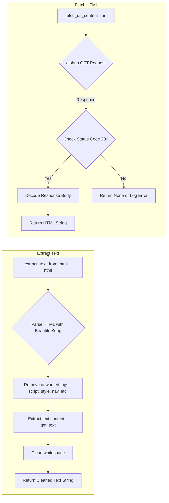
```mermaid
graph TD
    subgraph Fetching_HTML [Fetch HTML]
        A[fetch_url_content - url] --> B{aiohttp GET Request}
        B -- Response --> C{Check Status Code 200}
        C -- Yes --> D[Decode Response Body]
        C -- No --> E[Return None or Log Error]
        D --> F[Return HTML String]
    end

    subgraph Extraction [Extract Text]
        G[extract_text_from_html - html] --> H{Parse HTML with BeautifulSoup}
        H --> I[Remove unwanted tags - script, style, nav, etc.]
        I --> J[Extract text content - get_text]
        J --> K[Clean whitespace]
        K --> L[Return Cleaned Text String]
    end

    F --> G
```

Implementation details:
- Fetching handles redirects, timeouts, and uses a polite User-Agent.
- Extraction focuses on removing common boilerplate to isolate main content. `BeautifulSoup`'s lenient parsing handles malformed HTML.

### 5.3 Specialized Extractors (PyPI, Docs)

Tailored parsing logic for specific website structures.

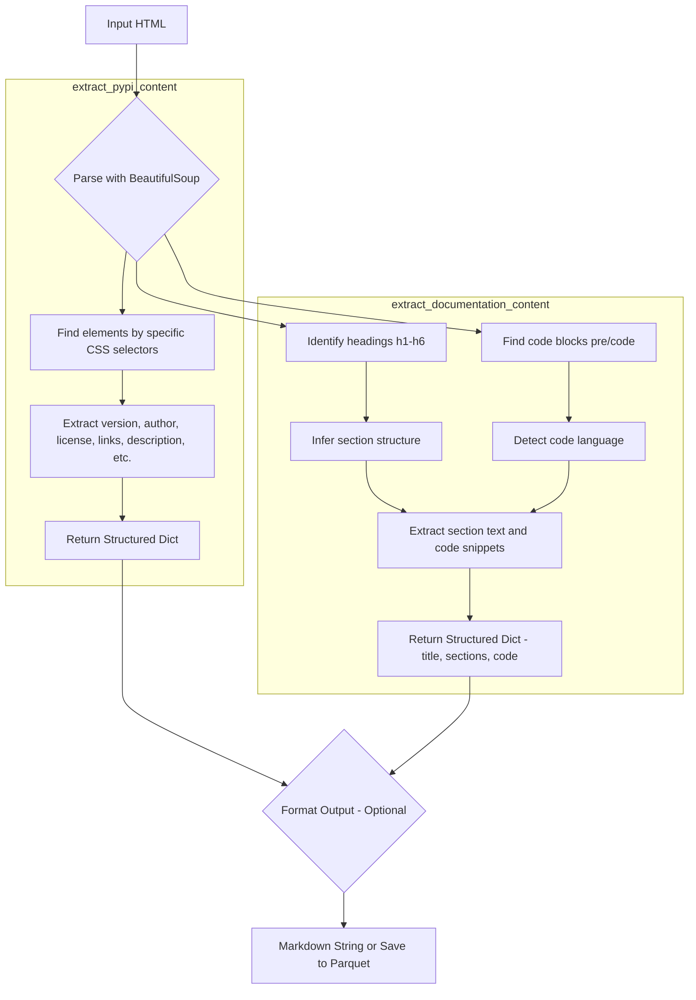
```mermaid
graph TB
    A[Input HTML] --> B{Parse with BeautifulSoup}

    subgraph PyPI_Extractor [extract_pypi_content]
        B --> C[Find elements by specific CSS selectors]
        C --> D[Extract version, author, license, links, description, etc.]
        D --> E[Return Structured Dict]
    end

    subgraph Docs_Extractor [extract_documentation_content]
        B --> F[Identify headings h1-h6]
        F --> G[Infer section structure]
        B --> H[Find code blocks pre/code]
        H --> I[Detect code language]
        G & I --> J[Extract section text and code snippets]
        J --> K[Return Structured Dict - title, sections, code]
    end

    E --> L{Format Output - Optional}
    K --> L
    L --> M[Markdown String or Save to Parquet]
```

Key points:
- **PyPI**: Relies on stable CSS selectors on `pypi.org/project/*` pages. Brittle if PyPI changes its layout.
- **Docs**: Uses common patterns found in Sphinx, MkDocs, etc. (e.g., heading hierarchy, `div.highlight-*` for code). Tries to preserve structure. Extracts code and attempts language detection.

### 5.4 Document Formatting

Converting structured data (from specialized extractors) back into readable Markdown.

```mermaid
sequenceDiagram
    participant ExtractedData as Dict (from extractor)
    participant Formatter as Formatting Function
    participant MarkdownOutput as String

    Formatter->>ExtractedData: Access title, version, sections, code_snippets etc.
    Formatter->>Formatter: Iterate through sections/data points
    Formatter->>Formatter: Apply Markdown syntax (#, ##, *, ```, [], () etc.)
    Formatter-->>MarkdownOutput: Append formatted text
    Formatter-->>MarkdownOutput: Final Markdown String
```

Implementation details:
- `format_pypi_info`: Creates sections for version, install, links, etc.
- `format_documentation`: Rebuilds document using headings, lists, and fenced code blocks (with language hints).
- Handles missing data gracefully by omitting sections.

## 6. ArXiv Crawler

*Component for retrieving data from the arXiv academic preprint server.*

Fetches paper metadata via the arXiv API and downloads paper source files (LaTeX).

### 6.1 Architecture

An asynchronous class interacting with the arXiv API and download endpoints.

```mermaid
classDiagram
    class ArxivCrawler {
        -data_dir: Path
        -session: aiohttp.ClientSession
        +__init__(data_dir: Optional[str]=None)
        +extract_arxiv_id(url_or_id: str) str
        +fetch_paper_info(arxiv_id: str) Dict
        +download_source(arxiv_id: str) Dict
        +fetch_paper_with_latex(arxiv_id: str) Dict
        +format_paper_for_learning(paper_info: Dict) str
        -_query_arxiv_api(id_list: List[str]) str # Returns XML string
        -_parse_arxiv_xml(xml_string: str) List[Dict]
        -_download_tarball(url: str, target_path: Path) bool
        -_extract_tarball(tarball_path: Path, extract_dir: Path) List[str]
        -_find_main_tex_file(extracted_files: List[str], extract_dir: Path) Optional[str]
        -_read_file_content(file_path: Path) Optional[str]
    }

    ArxivCrawler ..> aiohttp.ClientSession : uses
    ArxivCrawler ..> xml.etree.ElementTree : uses (or similar XML parser)
    ArxivCrawler ..> tarfile : uses
    ArxivCrawler ..> asyncio : uses
    ArxivCrawler ..> ParquetStorage : uses
    ArxivCrawler ..> re : uses (for ID extraction)
```

Key aspects:
- Asynchronous operations for API calls and downloads.
- Uses arXiv's official API for metadata.
- Parses Atom XML responses.
- Downloads `.tar.gz` source archives directly.
- Extracts tarballs and potentially identifies/reads the main `.tex` file.
- Stores metadata and source information using `ParquetStorage`.

### 6.2 Metadata Extraction

Querying the arXiv API and parsing the XML response.

```mermaid
graph TD
    A[Start: fetch_paper_info - arxiv_id] --> B[Validate or Normalize arXiv ID]
    B --> C[Construct API Query URL]
    C --> D{aiohttp GET Request to arXiv API}
    D -- Response --> E{Check Status and Content Type XML}
    E -- OK --> F[Parse Atom XML Response]
    F --> G[Extract fields: title, authors, abstract, date, categories, links, etc.]
    G --> H[Structure Metadata into Dictionary]
    H --> I[Save Metadata to Parquet]
    I --> J[Return Metadata Dictionary]
    E -- Error --> K[Return Error Dictionary or Raise Exception]
```

Implementation details:
- Uses the `http://export.arxiv.org/api/query` endpoint.
- Parses XML carefully to extract all relevant fields.
- Respects arXiv API usage policies (rate limiting, identification).

### 6.3 LaTeX Source Processing

Downloading, extracting, and optionally analyzing the `.tar.gz` source archive.

```mermaid
sequenceDiagram
    participant User
    participant AF as ArxivCrawler
    participant ArxivServer as arXiv Download Endpoint
    participant FileSystem as FS
    participant TarLib as tarfile
    participant ParquetStore as ParquetStorage

    User->>AF: download_source(arxiv_id)
    AF->>ArxivServer: Async HTTP GET Request (e.g., /e-print/arxiv_id)
    ArxivServer-->>AF: .tar.gz file stream
    AF->>FileSystem: Save stream to tarball_path
    FileSystem-->>AF: Tarball saved
    AF->>FileSystem: Create extraction directory (extract_path)
    AF->>TarLib: open(tarball_path)
    AF->>TarLib: extractall(extract_path)
    TarLib-->>FileSystem: Write extracted files
    FileSystem-->>AF: Extraction complete, list of files
    AF->>AF: _find_main_tex_file(extracted_files, extract_path)
    AF-->>AF: main_tex_filepath (optional)
    AF->>FileSystem: Read content of main_tex_filepath (optional)
    FileSystem-->>AF: latex_content (optional)
    AF->>AF: Structure source info (paths, files, content) into Dict
    AF->>ParquetStore: save_to_parquet(source_info, parquet_path)
    AF-->>User: Source Info Dictionary
```

Key points:
- Downloads the tarball from the `/e-print/` endpoint.
- Uses `tarfile` library for extraction.
- May include heuristics to find the main `.tex` file.
- Optionally reads the content of the main file.
- Stores paths and potentially main file content in Parquet.

### 6.4 Combined Workflows

Fetching metadata and source concurrently for efficiency.

```mermaid
graph TD
    A[Start: fetch_paper_with_latex - arxiv_id] --> B[Run Concurrently via asyncio.gather]
    B --> C[Task 1: fetch_paper_info - arxiv_id]
    B --> D[Task 2: download_source - arxiv_id]
    C --> E[Metadata Result - Dict]
    D --> F[Source Result - Dict]
    E --> G[Combine Metadata & Source Dictionaries]
    F --> G
    G --> H[Handle potential errors or partial success]
    H --> I[Save Combined Info to Parquet]
    I --> J[Return Combined Dictionary]
```

This approach uses `asyncio` to overlap the network-bound operations of fetching metadata and downloading the source archive.

## 7. Appendix

### 7.1 Glossary of Terms

| Term                 | Definition                                                                                             |
|----------------------|--------------------------------------------------------------------------------------------------------|
| **aiohttp**          | Asynchronous HTTP client/server framework for Python.                                                  |
| **API**              | Application Programming Interface; contract for software interaction.                                    |
| **Apache Arrow**     | Cross-language platform for in-memory columnar data; used by `pyarrow`.                                |
| **arXiv**            | Repository for electronic preprints of scientific papers.                                              |
| **arXiv API**        | Official interface for querying arXiv metadata.                                                        |
| **Async/Await**      | Python keywords for defining and running asynchronous code.                                            |
| **Asynchronous**     | Operations that can run independently, allowing the program to continue without waiting.               |
| **BeautifulSoup**    | Python library for parsing HTML and XML.                                                               |
| **Binary File**      | File containing non-text data (e.g., images, executables).                                             |
| **CLI**              | Command-Line Interface.                                                                                |
| **Code Similarity**  | Measure of resemblance between two code snippets.                                                      |
| **Columnar Storage** | Storing data by columns instead of rows (e.g., Parquet).                                               |
| **Crawler**          | Automated program that browses the web to collect data.                                                |
| **Data Flow Diagram**| Visual representation of data movement through a system.                                               |
| **DataFrame**        | Tabular data structure, commonly from the Pandas library.                                              |
| **DuckDuckGo**       | Privacy-focused search engine.                                                                         |
| **Embedding**        | Numerical vector representation of text or code, used for semantic search.                             |
| **Fuzzy Matching**   | Techniques for finding approximate string matches.                                                     |
| **Git**              | Distributed version control system.                                                                    |
| **GitHub**           | Web platform for hosting Git repositories.                                                             |
| **GitPython**        | Python library for interacting with Git repositories.                                                  |
| **HTML**             | HyperText Markup Language; standard for web pages.                                                     |
| **JSON**             | JavaScript Object Notation; lightweight data-interchange format.                                       |
| **LaTeX**            | Document preparation system, common for scientific papers.                                             |
| **LLM**              | Large Language Model; AI model for understanding and generating text.                                  |
| **Markdown**         | Lightweight markup language for text formatting.                                                       |
| **MCP**              | Model Context Protocol; a specification for AI models/tools interaction.                               |
| **Metadata**         | Data describing other data (e.g., file size, author, date).                                            |
| **Pandas**           | Python library for data manipulation and analysis.                                                     |
| **Parquet**          | Efficient, columnar storage format for large datasets.                                                 |
| **pyarrow**          | Python library for Apache Arrow, used for Parquet I/O.                                                 |
| **PyPI**             | Python Package Index; repository for Python software.                                                  |
| **pytube**           | Python library for downloading YouTube videos (or similar).                                            |
| **Rate Limiting**    | Restriction on the frequency of requests to an API or service.                                         |
| **Repository**       | Storage location, often for code (e.g., Git repository).                                               |
| **Schema**           | Formal description of data structure and types.                                                        |
| **Schema Evolution** | Managing changes to a data schema over time.                                                           |
| **Scraping**         | Extracting data from websites, often by parsing HTML.                                                  |
| **Sequence Diagram** | UML diagram showing object interactions over time.                                                     |
| **Serialization**    | Converting data structures into a format for storage or transmission.                                  |
| **SRT**              | SubRip Text; common file format for video subtitles.                                                   |
| **Tarball**          | Archive file format (`.tar`, often compressed as `.tar.gz`).                                           |
| **Tokenization**     | Breaking text or code into smaller units (tokens).                                                     |
| **User-Agent**       | HTTP header identifying the client software making a request.                                          |
| **XML**              | Extensible Markup Language; format for encoding documents.                                             |
| **YouTube Data API** | Google's official API for interacting with YouTube.                                                    |

## See Also

- [API Reference](./API.md)
- [CLI Reference](./CLI.md)
- [Examples](./Examples.md#cli-examples)
- [Examples: YouTube](./Examples.md#youtube-cli-examples)
- [Examples: GitHub](./Examples.md#github-cli-examples)
- [Examples: ArXiv](./Examples.md#arxiv-cli-examples)
- [Examples: DuckDuckGo](./Examples.md#duckduckgo-cli-examples)
- [Examples: Web Crawler](./Examples.md#web-crawler-cli-examples)
- [Examples: Data Management](./Examples.md#data-management-cli-examples)
