# OARC Crawlers Project Structure

This document outlines the typical directory structure and key files within the `oarc-crawlers` project.

```bash
.
├── .github/                # GitHub Actions workflows (CI/CD, linting)
│   └── workflows/
│       └── python-package.yml # Example workflow
├── .gitignore              # Specifies intentionally untracked files for Git
├── .flake8                 # Configuration for Flake8 linter
├── .pylintrc               # Configuration for Pylint linter
├── docs/                   # Project documentation (Markdown files)
│   ├── API.md              # Detailed API reference for modules/classes
│   ├── CLI.md              # Command-Line Interface usage guide
│   ├── Crawlers.md         # In-depth explanation of crawler components
│   ├── Project.md          # This file: Project structure overview
│   ├── Specification.md    # Technical specification of the framework
│   ├── CHEATSHEET.md       # Quick reference guide (if exists)
│   ├── Examples.md         # Guide linking to example scripts (if exists)
│   ├── Troubleshoot.md     # Common issues and solutions (if exists)
│   ├── VSCodeMCP.md        # Specifics on VS Code MCP integration (if exists)
│   └── __TODO.md           # Internal TODO list for documentation
├── examples/               # Example Python scripts demonstrating usage
│   ├── arxiv_example.py
│   ├── beautifulsoup_example.py
│   ├── ddg_example.py
│   ├── github_example.py
│   ├── youtube_example.py
│   └── run_all_examples.py # Script to run examples (if exists)
├── src/                    # Main source code directory
│   └── oarc_crawlers/      # The Python package itself
│       ├── __init__.py     # Makes 'oarc_crawlers' a package, exports main classes/functions
│       ├── main.py         # Main entry point for the CLI application (uses Typer/Click)
│       ├── api/            # Modules related to external API interactions (if separated)
│       ├── cli/            # Modules defining CLI commands and subcommands
│       │   ├── __init__.py
│       │   ├── arxiv_cli.py
│       │   ├── gh_cli.py
│       │   ├── yt_cli.py
│       │   └── ...         # Other CLI command group modules
│       ├── config/         # Configuration loading and management
│       │   ├── __init__.py
│       │   └── settings.py # Handles loading from files/env vars
│       ├── core/           # Core logic for crawlers (can replace individual files below)
│       │   ├── __init__.py
│       │   ├── arxiv_fetcher.py
│       │   ├── bs_crawler.py
│       │   ├── ddg_searcher.py
│       │   ├── gh_crawler.py
│       │   └── yt_downloader.py
│       ├── utils/          # Utility functions shared across modules
│       │   ├── __init__.py
│       │   ├── http_client.py # Shared async HTTP client setup (e.g., aiohttp session)
│       │   ├── logging_config.py # Logging setup
│       │   ├── parquet_storage.py # Parquet I/O utilities
│       │   └── paths.py      # Path management utilities
│       ├── mcp_api.py      # Logic for the Model Context Protocol server (if applicable)
│       └── version.py      # Defines package version (__version__)
├── tests/                  # Unit and integration tests
│   ├── __init__.py
│   ├── conftest.py         # Pytest fixtures and configuration
│   ├── test_arxiv.py
│   ├── test_bs_crawler.py
│   ├── test_ddg.py
│   ├── test_github_crawler.py
│   ├── test_parquet_storage.py
│   ├── test_yt_downloader.py
│   └── ...                 # Other test modules
├── pyproject.toml          # Build system requirements, package metadata (PEP 517/518)
├── pytest.ini              # Configuration for Pytest test runner
├── README.md               # Main project overview, installation, basic usage
├── LICENSE                 # Project license file (e.g., Apache 2.0, MIT)
└── requirements-dev.txt    # Development dependencies (linters, testing tools) (Optional)
```

## Project Structure Diagram

The following diagram visualizes the main directories and files in the OARC Crawlers codebase, and how they are linked or referenced by each other.

```mermaid
graph TD
    %% Top-level directories
    A[.github/] --> A1[workflows/]
    B[docs/]
    C[examples/]
    D[src/]
    E[tests/]
    F[pyproject.toml]
    G[README.md]
    H[LICENSE]

    %% .github
    A1 --> A2[python-package.yml]

    %% docs
    B --> B1[API.md]
    B --> B2[CLI.md]
    B --> B3[Crawlers.md]
    B --> B4[Project.md]
    B --> B5[Specification.md]
    B --> B6[CHEATSHEET.md]
    B --> B7[Examples.md]
    B --> B8[Troubleshoot.md]
    B --> B9[VSCodeMCP.md]
    B --> B10[__TODO.md]

    %% examples
    C --> C1[arxiv_example.py]
    C --> C2[beautifulsoup_example.py]
    C --> C3[ddg_example.py]
    C --> C4[github_example.py]
    C --> C5[youtube_example.py]
    C --> C6[run_all_examples.py]

    %% src
    D --> D1[oarc_crawlers/]
    D1 --> D1a[__init__.py]
    D1 --> D1b[main.py]
    D1 --> D1c[api/]
    D1 --> D1d[cli/]
    D1 --> D1e[config/]
    D1 --> D1f[core/]
    D1 --> D1g[utils/]
    D1 --> D1h[mcp_api.py]
    D1 --> D1i[version.py]

    %% src/oarc_crawlers/cli
    D1d --> D1d1[__init__.py]
    D1d --> D1d2[arxiv_cli.py]
    D1d --> D1d3[gh_cli.py]
    D1d --> D1d4[yt_cli.py]
    D1d --> D1d5[ddg_cli.py]
    D1d --> D1d6[web_cli.py]
    D1d --> D1d7[build_cli.py]
    D1d --> D1d8[publish_cli.py]
    D1d --> D1d9[mcp_cli.py]
    D1d --> D1d10[config_cli.py]

    %% src/oarc_crawlers/config
    D1e --> D1e1[__init__.py]
    D1e --> D1e2[settings.py]
    D1e --> D1e3[config_validators.py]
    D1e --> D1e4[config_manager.py]
    D1e --> D1e5[config_editor.py]
    D1e --> D1e6[config.py]

    %% src/oarc_crawlers/core
    D1f --> D1f1[__init__.py]
    D1f --> D1f2[arxiv_fetcher.py]
    D1f --> D1f3[bs_crawler.py]
    D1f --> D1f4[ddg_searcher.py]
    D1f --> D1f5[gh_crawler.py]
    D1f --> D1f6[yt_downloader.py]
    D1f --> D1f7[storage/]
    D1f --> D1f8[mcp/]
    D1f7 --> D1f7a[__init__.py]
    D1f7 --> D1f7b[parquet_storage.py]
    D1f8 --> D1f8a[__init__.py]
    D1f8 --> D1f8b[mcp_server.py]
    D1f8 --> D1f8c[mcp_manager.py]

    %% src/oarc_crawlers/utils
    D1g --> D1g1[__init__.py]
    D1g --> D1g2[http_client.py]
    D1g --> D1g3[logging_config.py]
    D1g --> D1g4[parquet_storage.py]
    D1g --> D1g5[paths.py]
    D1g --> D1g6[storage_utils.py]
    D1g --> D1g7[mcp_utils.py]
    D1g --> D1g8[crawler_utils.py]
    D1g --> D1g9[const.py]
    D1g --> D1g10[build_utils.py]

    %% src/oarc_crawlers/api
    D1c --> D1c1[__init__.py]

    %% Edges: CLI commands to core logic
    D1d2 --> D1f2
    D1d3 --> D1f5
    D1d4 --> D1f6
    D1d5 --> D1f4
    D1d6 --> D1f3
    D1d7 --> D1f7
    D1d8 --> D1f7
    D1d9 --> D1f8
    D1d10 --> D1e

    %% Edges: core logic to utils
    D1f2 --> D1g4
    D1f3 --> D1g2
    D1f4 --> D1g2
    D1f5 --> D1g8
    D1f6 --> D1g4
    D1f7b --> D1g4

    %% Edges: main.py to CLI
    D1b --> D1d

    %% Edges: config usage
    D1b --> D1e
    D1d --> D1e
    D1f --> D1e

    %% Edges: tests
    E --> E1[__init__.py]
    E --> E2[conftest.py]
    E --> E3[test_arxiv.py]
    E --> E4[test_bs_crawler.py]
    E --> E5[test_ddg.py]
    E --> E6[test_github_crawler.py]
    E --> E7[test_parquet_storage.py]
    E --> E8[test_yt_downloader.py]

    %% Edges: examples to src
    C1 --> D1f2
    C2 --> D1f3
    C3 --> D1f4
    C4 --> D1f5
    C5 --> D1f6

    %% Edges: docs to src
    B1 --> D1f
    B2 --> D1d
    B3 --> D1f
    B4 --> D1
    B5 --> D1

    %% Edges: pyproject.toml to src
    F --> D1

    %% Edges: README.md to docs
    G --> B

    %% Edges: LICENSE to all
    H --> D1
    H --> C
    H --> E

    %% Edges: version.py to all src
    D1i --> D1
```



**Legend:**
- **Rectangles**: Directories and files.
- **Arrows**: "Uses", "imports", or "references" relationships.
- **CLI modules** point to their corresponding core logic.
- **Core modules** use utilities and config.
- **Examples** and **tests** use the main package modules.
- **Docs** reference the codebase and each other.

---