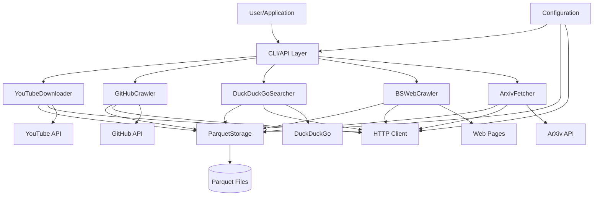
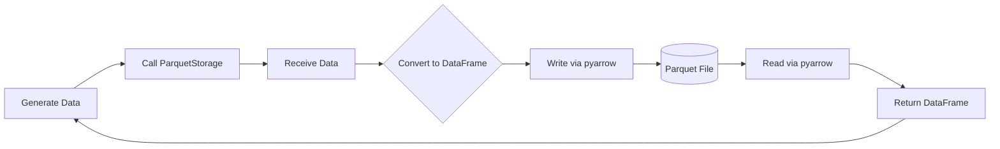
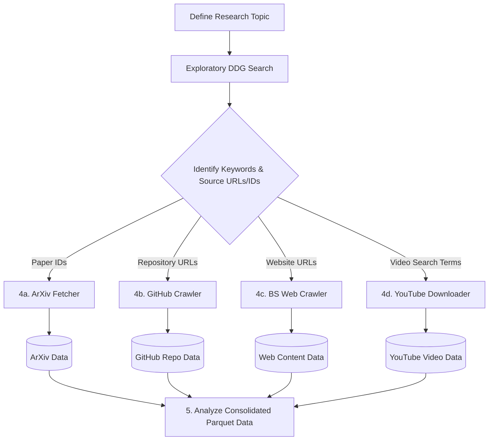
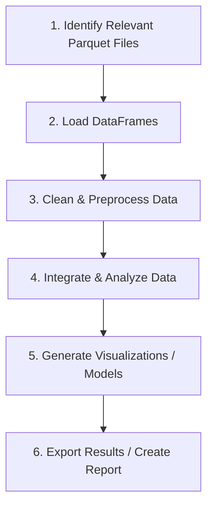

# OARC-Crawlers: Technical Specification

This document provides the technical specification for the OARC-Crawlers framework. It details the system architecture, individual components, data handling strategies, API usage, and common workflows, serving as a comprehensive guide for understanding and utilizing the framework.

## Table of Contents
- [1. Introduction](#1-introduction)
- [2. System Overview](#2-system-overview)
  - [2.1 Core Concepts](#21-core-concepts)
  - [2.2 Architecture](#22-architecture)
  - [2.3 Data Storage](#23-data-storage)
- [3. Components](#3-components)
- [4. API Reference](#4-api-reference)
- [5. Common Workflows](#5-common-workflows)
  - [5.1 Research Workflow](#51-research-workflow)
  - [5.2 Data Analysis Workflow](#52-data-analysis-workflow)
  - [5.3 Code Analysis Workflow](#53-code-analysis-workflow)
- [6. Error Handling and Logging](#6-error-handling-and-logging)
- [7. Performance Considerations](#7-performance-considerations)
- [8. Configuration](#8-configuration)
- [9. Conclusion](#9-conclusion)
- [10. Appendix](#10-appendix)
  - [10.1 Glossary of Terms](#101-glossary-of-terms)
  - [10.2 Directory Structure](#102-directory-structure)
- [See Also](#see-also)

## 1. Introduction

OARC-Crawlers is a Python framework designed for efficient acquisition, processing, and storage of data from diverse online sources, including academic repositories (ArXiv), code hosting platforms (GitHub), video platforms (YouTube), search engines (DuckDuckGo), and general websites. Built on principles of modularity, asynchronous operation, and unified data persistence using Apache Parquet, the framework provides specialized crawlers and common workflows to streamline data collection for research, analysis, and development tasks.

## 2. System Overview

### 2.1 Core Concepts

The OARC-Crawlers framework adheres to these fundamental principles:

1.  **Modularity**: Each data source (YouTube, GitHub, ArXiv, etc.) is handled by a distinct, specialized component (crawler module), promoting separation of concerns and maintainability. See [Components](#3-components).
2.  **Asynchronous Design**: Leverages Python's `asyncio` library for non-blocking I/O operations, maximizing performance for network-bound tasks like fetching data from APIs or websites. See [Performance Considerations](#7-performance-considerations).
3.  **Unified Data Storage**: Employs Apache Parquet as the standard format for persistent storage across all modules, facilitated by a central `ParquetStorage` utility. This ensures data is stored efficiently and is readily consumable by analysis tools. See [Data Storage](#23-data-storage).
4.  **Structured Outputs**: Crawler operations return data in predictable formats, typically Python dictionaries or Pandas DataFrames for programmatic use, and often offer Markdown formatting for human-readable summaries.
5.  **Resilience & Observability**: Incorporates robust error handling within individual operations and standardized logging practices to ensure operational stability and aid troubleshooting. See [Error Handling and Logging](#6-error-handling-and-logging).
6.  **Configurability**: Allows customization of behavior (e.g., data directories, timeouts, API keys) through configuration files and environment variables. See [Configuration](#8-configuration).

### 2.2 Architecture

OARC-Crawlers employs a modular, service-oriented architecture designed for extensibility and maintainability. Interaction originates from a user or application via defined entry points, primarily the Command-Line Interface (CLI) or programmatic Application Programming Interfaces (APIs). These entry points delegate tasks to specialized, asynchronous crawler modules. Each module encapsulates the logic for interacting with a specific external data source or API. Common functionalities, such as persistent data storage and HTTP communication, are abstracted into shared utility components, promoting code reuse and consistency. Configuration settings, managed through files and environment variables, influence the behavior of various architectural layers.



**Architectural Characteristics:**

-   **Entry Points**: User interaction is facilitated through the `oarc-crawlers` CLI (implemented via `src/oarc_crawlers/main.py` and `src/oarc_crawlers/cli/`) or programmatically via the APIs exposed by individual modules. An optional Model Context Protocol (MCP) server (`mcp_api.py`) offers an additional integration pathway.
-   **Crawler Modules**: Residing within `src/oarc_crawlers/core/` (or as distinct files), these modules contain the source-specific data acquisition and processing logic (e.g., `yt_downloader.py`, `gh_crawler.py`). They are implemented using Python's `async`/`await` syntax for asynchronous execution.
-   **Shared Utilities**: Located in `src/oarc_crawlers/utils/`, these components provide cross-cutting concerns:
    -   `parquet_storage.py`: Centralizes all read/write operations for Apache Parquet files.
    -   `http_client.py` (Conceptual): Manages a shared asynchronous HTTP client (e.g., `aiohttp.ClientSession`) for efficient network requests.
    -   `logging_config.py`: Ensures standardized logging configuration across the framework.
    -   `paths.py` (Conceptual): Provides utilities for managing file system paths related to data, configuration, and cache directories.
-   **Configuration Management**: Handled by `src/oarc_crawlers/config/`, this component aggregates settings from INI files and environment variables, providing a unified configuration view to the framework.

### 2.3 Data Storage

The framework mandates Apache Parquet as the standard format for persisting structured data acquired by the crawlers. This strategy is implemented and enforced by the `ParquetStorage` utility component (`src/oarc_crawlers/utils/parquet_storage.py`).

**Rationale for Parquet:**

1.  **Storage Efficiency**: The columnar storage paradigm enables high compression ratios and reduces storage footprint compared to row-oriented formats.
2.  **Query Performance**: Analytical queries that access only a subset of columns benefit significantly from the columnar layout, minimizing I/O operations. `pyarrow` provides optimized read/write capabilities.
3.  **Schema Enforcement and Evolution**: Parquet files embed their schema, facilitating data validation and interpretation. The `ParquetStorage` utility is designed to accommodate schema evolution during data appending operations.
4.  **Ecosystem Interoperability**: Parquet is a de facto standard in the data processing ecosystem, supported by tools such as Pandas, Spark, Dask, Polars, and various database systems.

**Storage Mechanism:**

The process of persisting data involves the following steps:
-   Crawler modules generate structured data, typically represented as Python lists of dictionaries or Pandas DataFrames.
-   These modules invoke methods on the `ParquetStorage` utility, such as `save_to_parquet()` for initial writes or `append_to_parquet()` for adding data to existing files.
-   The `ParquetStorage` utility performs necessary data transformations (e.g., conversion to a DataFrame), ensures the existence of target directories, and utilizes the `pyarrow` library to serialize and write the data to a Parquet file.
-   Data retrieval is accomplished via `ParquetStorage.load_from_parquet()`, which reads the specified Parquet file and returns its contents as a Pandas DataFrame, or `None` if an error occurs during loading.



This standardized approach ensures that all persistent structured data adheres to a consistent, efficient, and readily analyzable format. It is important to note that raw downloaded artifacts (e.g., video files, source code archives) are stored directly on the filesystem, while their associated metadata is typically captured and stored in corresponding Parquet files.

## 3. Components

The OARC-Crawlers framework comprises several key components, each specializing in a data source or core function:

1.  **Parquet Storage (`utils.parquet_storage`)**: Central utility for saving, loading, and appending data in Apache Parquet format. Ensures consistent and efficient data persistence.
2.  **YouTube Downloader (`core.yt_downloader`)**: Handles interactions with YouTube. Downloads videos and playlists, extracts captions, performs searches, and saves relevant metadata.
3.  **GitHub Crawler (`core.gh_crawler`)**: Interacts with GitHub repositories. Clones repositories, processes files (detecting language, extracting content), generates summaries, finds similar code, and supports natural language queries.
4.  **DuckDuckGo Searcher (`core.ddg_searcher`)**: Performs web searches (text, image, news) using the DuckDuckGo engine, focusing on privacy and returning structured or formatted results.
5.  **BeautifulSoup Web Crawler (`core.bs_crawler`)**: Fetches and parses general web pages using `aiohttp` and `BeautifulSoup`. Includes generic text extraction and specialized parsers for PyPI package pages and documentation sites.
6.  **ArXiv Fetcher (`core.arxiv_fetcher`)**: Interacts with the ArXiv repository. Fetches paper metadata via the API and downloads paper source files (LaTeX tarballs).
7.  **CLI Layer (`cli/`, `main.py`)**: Provides the command-line interface, parsing arguments and dispatching tasks to the appropriate core crawler modules. Uses libraries like Typer or Click.
8.  **Configuration (`config/`)**: Manages loading settings from configuration files (INI) and environment variables.
9.  **Shared Utilities (`utils/`)**: Contains common helpers for HTTP requests, logging, path management, etc., used by multiple crawlers.
10. **MCP Server (`mcp_api.py`)**: (If enabled) Exposes crawler functionalities via the Model Context Protocol for integration with external tools like VS Code.

Detailed descriptions, architectures, and data flows for the main crawler components (1-6) can be found in the [Crawlers documentation](./Crawlers.md).

## 4. API Reference

A detailed reference for the public APIs of each component is available in the [API Reference document](./API.md). This includes:

-   Class initializers (`__init__`).
-   Public methods with signatures, parameters, return types, and descriptions.
-   Usage examples for key methods.
-   Error handling specifics for each method.
-   Notes on asynchronous (`async`) methods.

Consult [API.md](./API.md) for specifics on how to interact with each crawler module programmatically.

## 5. Common Workflows

OARC-Crawlers is designed to support various data collection and analysis paradigms by orchestrating its constituent components.

### 5.1 Research Workflow

This workflow exemplifies the process of gathering multi-modal information pertaining to a specific research topic:

1.  **Exploratory Search**: Utilize the `DuckDuckGoSearcher` (`ddg text` command) to perform initial web searches. This step aims to identify relevant keywords, seminal publications, key software projects, or influential researchers.
2.  **Literature Acquisition**: Employ the `ArxivFetcher` (`arxiv search`, `arxiv info`, `arxiv download` commands) to locate and retrieve pertinent academic literature from the ArXiv repository, using keywords or specific paper identifiers discovered previously.
3.  **Codebase Analysis**: Leverage the `GitHubCrawler` (`gh analyze`, `gh clone`, `gh query` commands) to identify, download, and analyze software repositories associated with the research topic, potentially referenced in publications or discovered through search.
4.  **Web Content Extraction**: Use the `BSWebCrawler` (`web crawl`, `web docs` commands) to extract textual information from relevant project websites, technical documentation, or blog posts identified during the exploratory phase.
5.  **Video Resource Gathering**: Employ the `YouTubeDownloader` (`yt search`, `yt download`, `yt captions` commands) to find and acquire relevant video materials, such as tutorials, conference presentations, or expert discussions.
6.  **Data Consolidation**: The structured outputs (metadata, search results, repository analysis data) generated by each component are systematically stored in the Parquet format. This unified storage facilitates subsequent integrated analysis across diverse data types.



### 5.2 Data Analysis Workflow

This workflow outlines the steps for analyzing data previously collected and stored in Parquet format by the framework:

1.  **Data Ingestion**: Load the relevant Parquet datasets into memory using `ParquetStorage.load_from_parquet()` or directly via data analysis libraries like Pandas (`pd.read_parquet`) or Polars.
2.  **Data Cleansing and Preprocessing**: Apply necessary data cleaning techniques, including handling missing values, normalizing formats, converting data types, and potentially deriving new features from existing columns.
3.  **Data Integration and Analysis**: Merge or join DataFrames originating from different crawler components as required (e.g., correlating paper metadata with repository analysis results). Perform statistical analyses, generate visualizations, or apply machine learning models.
4.  **Result Dissemination**: Persist the processed data or analysis outcomes to new Parquet files, alternative formats (e.g., CSV), databases, or incorporate them into analytical reports.



### 5.3 Code Analysis Workflow

This workflow focuses on the specific task of analyzing software repositories obtained via the `GitHubCrawler`:

1.  **Repository Acquisition and Processing**: Utilize `GitHubCrawler.clone_and_store_repo()` (accessible via `gh analyze` or `gh clone` CLI commands) to download target repositories and generate structured data representing their file contents, stored as a Parquet file.
2.  **Data Loading**: Ingest the generated Parquet file(s) containing repository file information into a Pandas DataFrame.
3.  **Metric Computation**: Calculate quantitative metrics from the DataFrame, such as programming language distribution (based on file extensions or content analysis), file size statistics, and source lines of code (SLOC) estimations.
4.  **Targeted Content Exploration**: Employ `GitHubCrawler.find_similar_code()` (`gh find-similar`) to locate code segments resembling a given snippet, or use `GitHubCrawler.query_repo_content()` (`gh query`) for natural language-based querying of the codebase (if supported).
5.  **In-depth Static Analysis**: Perform more sophisticated analyses directly on the source code content available in the DataFrame's `content` column. This may involve Abstract Syntax Tree (AST) parsing, dependency graph construction, code complexity measurements (e.g., cyclomatic complexity), or vulnerability scanning.
6.  **Comparative Analysis**: Extend the workflow by loading data from multiple repositories to facilitate comparative studies of architectural patterns, language usage trends, code similarity, or evolution over time.

```mermaid
graph TD
    A[1. Identify Target Repositories] --> B[2. GitHubCrawler: Clone & Process]
    B --> C[(3. Repository Data in Parquet)]
    C --> D[4. Load DataFrame]
    subgraph Analysis Steps
        D --> E[5a. Calculate Basic Metrics]
        D --> F[5b. Perform Similarity/Query Search]
        D --> G[5c. Custom Static Analysis (AST, etc.)]
    end
    E & F & G --> H[6. Synthesize Findings / Report]
```

## 6. Error Handling and Logging

The framework prioritizes resilience and observability:

1.  **Standardized Logging**:
    *   Uses Python's `logging` module configured via `utils.logging_config`.
    *   Provides informative logs at different levels (`DEBUG`, `INFO`, `WARNING`, `ERROR`). `INFO` tracks progress, `WARNING` indicates recoverable issues (e.g., skipping a file), `ERROR` reports failures in specific operations, `DEBUG` provides verbose details (enabled via `--verbose` or `OARC_LOG_LEVEL=DEBUG`).
    *   Logs include timestamps, module names, and contextual information.

2.  **Exception Handling**:
    *   Individual operations within crawlers (e.g., fetching one URL, processing one file, downloading one video) typically use `try...except` blocks to catch expected errors (`ConnectionError`, `TimeoutError`, `FileNotFoundError`, `PermissionError`, `ValueError`, API-specific exceptions).
    *   Instead of letting exceptions halt a larger process (like downloading a playlist), errors are often logged, and the operation returns a status indicator (e.g., `None`, an empty list, or a dictionary with an `'error'` key and `'status': 'failed'`).
    *   This allows batch operations to continue despite individual failures. Critical configuration or setup errors might still raise exceptions.

3.  **Resilience**:
    *   The combination of contained errors and informative logging makes workflows robust against transient network issues or problematic individual data items.
    *   Users can typically identify failed items from logs or summary results and potentially retry them later.

## 7. Performance Considerations

Performance is addressed through several design choices:

1.  **Asynchronous I/O**: `asyncio` with `aiohttp` is used for all network operations (API calls, downloads, web fetching), allowing high concurrency and efficient handling of network latency. Disk I/O for Parquet writing might also leverage async methods if beneficial.
2.  **Efficient Data Format**: Apache Parquet provides efficient compression and columnar access, speeding up both storage and subsequent analytical reads compared to row-oriented formats like CSV or JSON lines, especially for large datasets.
3.  **Resource Management**:
    *   Shared `aiohttp.ClientSession` can reuse connections.
    *   Temporary directories used during operations (like repo cloning) are managed and cleaned up.
    *   Stream processing is used where possible for downloads to avoid loading large files entirely into memory.
4.  **Configurable Limits**: Operations like search (`max_results`), playlist downloads (`max_videos`), and file processing (`max_file_size_kb`) have limits to control resource usage and execution time.
5.  **Selective Processing**: Logic exists to skip large binary files or apply different processing levels based on file type/size, focusing resources on relevant content.

**Scaling Considerations:**
*   For very large tasks, ensure sufficient system resources (RAM, CPU, disk IOPS, network bandwidth).
*   Adjust concurrency limits if hitting API rate limits or overwhelming local resources.
*   Consider distributing workloads across multiple machines or using task queues (e.g., Celery, RQ, Dask) for massive-scale crawling, integrating OARC-Crawlers components as task workers.

## 8. Configuration

OARC-Crawlers uses a layered configuration system:

1.  **Defaults**: Hardcoded default values within the code.
2.  **Configuration File(s)**: INI files loaded typically from platform-specific locations (`~/.config/oarc/` on Linux, `%APPDATA%\oarc\config` on Windows) or a path specified by `--config` or `OARC_CONFIG_PATH`. Settings here override defaults.
3.  **Environment Variables**: Variables like `OARC_DATA_DIR`, `OARC_TIMEOUT`, `OARC_LOG_LEVEL` override file settings and defaults. See [CLI.md](./CLI.md#environment-variables) for a list.
4.  **Command-Line Arguments**: Options like `--data-dir`, `--verbose`, `--limit` override all lower layers for a specific command execution.

The `src/oarc_crawlers/config/` module typically handles loading and merging these layers. The `oarc-crawlers config` CLI command provides an interactive way to manage the configuration files.

Key configurable items often include:
-   Default data, cache, and config directories.
-   Logging level.
-   Network timeouts and retry counts.
-   User-Agent string.
-   Proxy settings.
-   API keys (should be handled securely, potentially via environment variables or dedicated secrets management).
-   Default limits for operations (e.g., max search results).

## 9. Conclusion

OARC-Crawlers provides a modular, asynchronous, and configurable Python framework for collecting data from various web sources. By standardizing on Parquet for efficient storage and offering specialized components for common targets like YouTube, GitHub, and ArXiv, it aims to simplify and accelerate data acquisition for research and analysis. Its focus on resilience, structured output, and clear interfaces (CLI, API, MCP) makes it a versatile tool for diverse data gathering tasks.

## 10. Appendix

### 10.1 Glossary of Terms

| Term                 | Definition                                                                                             |
|----------------------|--------------------------------------------------------------------------------------------------------|
| **aiohttp**          | Asynchronous HTTP client/server framework for Python, used for network requests.                       |
| **API**              | Application Programming Interface; Defines how software components interact.                             |
| **Apache Arrow**     | Cross-language platform for in-memory columnar data; used by `pyarrow`.                                |
| **Apache Parquet**   | Efficient, columnar storage file format used for persistent data storage in the framework.             |
| **ArXiv**            | Online repository for scientific paper preprints.                                                      |
| **Async/Await**      | Python keywords for defining and running asynchronous, non-blocking code.                              |
| **Asynchronous**     | Operations that allow the program to continue executing other tasks without waiting for completion.    |
| **BeautifulSoup**    | Python library for parsing HTML and XML documents.                                                     |
| **CLI**              | Command-Line Interface; Text-based interface for interacting with the framework.                       |
| **Columnar Storage** | Data storage method where values for each column are stored contiguously (e.g., Parquet).              |
| **Component**        | A distinct module or part of the framework responsible for a specific function (e.g., a crawler).      |
| **Configuration**    | Settings that control the framework's behavior (e.g., paths, timeouts, API keys).                      |
| **Crawler**          | An automated component designed to fetch and process data from a specific online source.               |
| **DataFrame**        | A two-dimensional labeled data structure, typically from the Pandas library.                           |
| **DuckDuckGo**       | Privacy-focused search engine.                                                                         |
| **Git**              | Distributed version control system.                                                                    |
| **GitHub**           | Web platform for hosting Git repositories and software development.                                    |
| **GitPython**        | Python library for interacting with Git repositories.                                                  |
| **HTML**             | HyperText Markup Language; Standard markup language for creating web pages.                            |
| **JSON**             | JavaScript Object Notation; Lightweight text-based data interchange format.                            |
| **LaTeX**            | Document preparation system commonly used for scientific and technical documents.                      |
| **LLM**              | Large Language Model; Type of AI model used for understanding and generating text (e.g., in `gh query`). |
| **Logging**          | Recording events and errors that occur during the execution of the framework.                          |
| **Markdown**         | Lightweight markup language used for documentation and formatted text output.                          |
| **MCP**              | Model Context Protocol; Specification for interaction between AI models and tools (like crawlers).     |
| **Metadata**         | Data that provides information about other data (e.g., file size, author, creation date).              |
| **Modularity**       | Design principle where the system is composed of independent, interchangeable components.              |
| **Pandas**           | Python library providing high-performance data structures (like DataFrame) and analysis tools.         |
| **ParquetStorage**   | The specific utility component within OARC-Crawlers responsible for Parquet I/O.                       |
| **pyarrow**          | Python library providing the interface to Apache Arrow and Parquet file operations.                    |
| **PyPI**             | Python Package Index; The official third-party software repository for Python.                         |
| **pytube**           | Python library (or similar) used for interacting with YouTube.                                         |
| **Rate Limiting**    | Restriction imposed by APIs on the number of requests allowed within a specific time period.           |
| **Repository**       | A storage location for project files, often managed by version control (e.g., a Git repository).       |
| **Resilience**       | The ability of the system to handle errors gracefully and continue operating.                          |
| **Schema**           | The structure or blueprint of data, defining fields and their types.                                   |
| **Scraping**         | Extracting data from websites, typically by parsing their HTML structure.                              |
| **Serialization**    | Converting data structures into a format suitable for storage or transmission.                         |
| **Workflow**         | A sequence of steps or operations performed using the framework to achieve a specific goal.            |
| **XML**              | Extensible Markup Language; Markup language for encoding documents in a human-readable format.         |
| **YouTube**          | Video-sharing platform.                                                                                |

### 10.2 Directory Structure

```bash
oarc-crawlers/
├── .github/                 # GitHub Actions CI/CD workflows
├── docs/                    # Documentation files (API.md, CLI.md, etc.)
├── examples/                # Example usage scripts
├── src/
│   └── oarc_crawlers/       # Main Python package source
│       ├── __init__.py      # Package initializer
│       ├── main.py          # CLI entry point script
│       ├── api/             # (Potential) Modules for external API interaction logic
│       ├── cli/             # Modules defining CLI commands (Typer/Click apps)
│       ├── config/          # Configuration loading logic
│       ├── core/            # Core crawler implementations (arxiv, bs, ddg, gh, yt)
│       ├── utils/           # Shared utilities (parquet, http, logging, paths)
│       ├── mcp_api.py       # (Potential) MCP server implementation
│       └── version.py       # Package version definition
├── tests/                   # Automated tests (unit, integration)
├── .gitignore               # Git ignore rules
├── .flake8                  # Flake8 config
├── .pylintrc                # Pylint config
├── pyproject.toml           # Build config, dependencies, package metadata
├── pytest.ini               # Pytest config
├── README.md                # Project overview
└── LICENSE                  # License file
```

## See Also

- [API Reference](./API.md)
- [CLI Reference](./CLI.md)
- [Examples](./Examples.md#cli-examples)
- [Examples: YouTube](./Examples.md#youtube-cli-examples)
- [Examples: GitHub](./Examples.md#github-cli-examples)
- [Examples: ArXiv](./Examples.md#arxiv-cli-examples)
- [Examples: DuckDuckGo](./Examples.md#duckduckgo-cli-examples)
- [Examples: Web Crawler](./Examples.md#web-crawler-cli-examples)
- [Examples: Data Management](./Examples.md#data-management-cli-examples)
