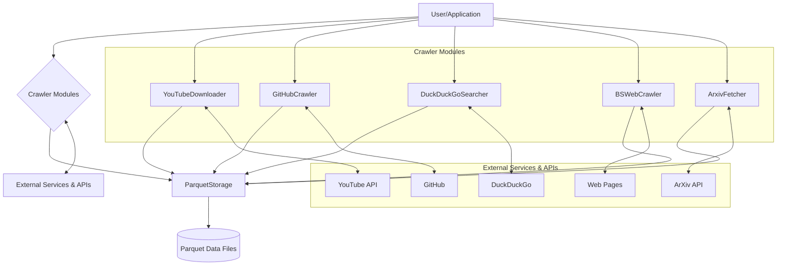
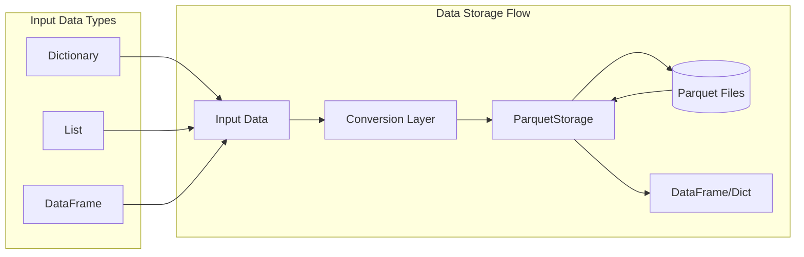
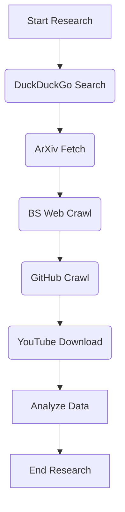
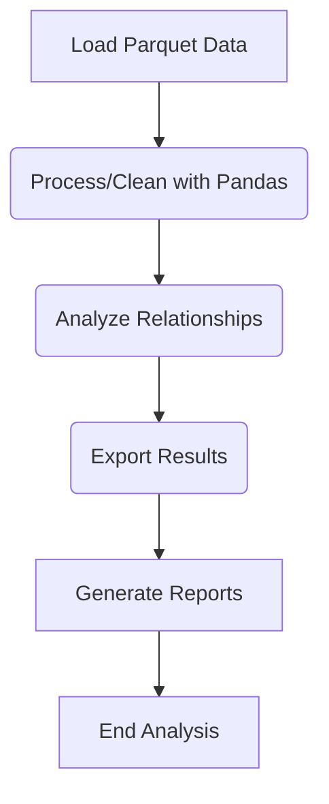
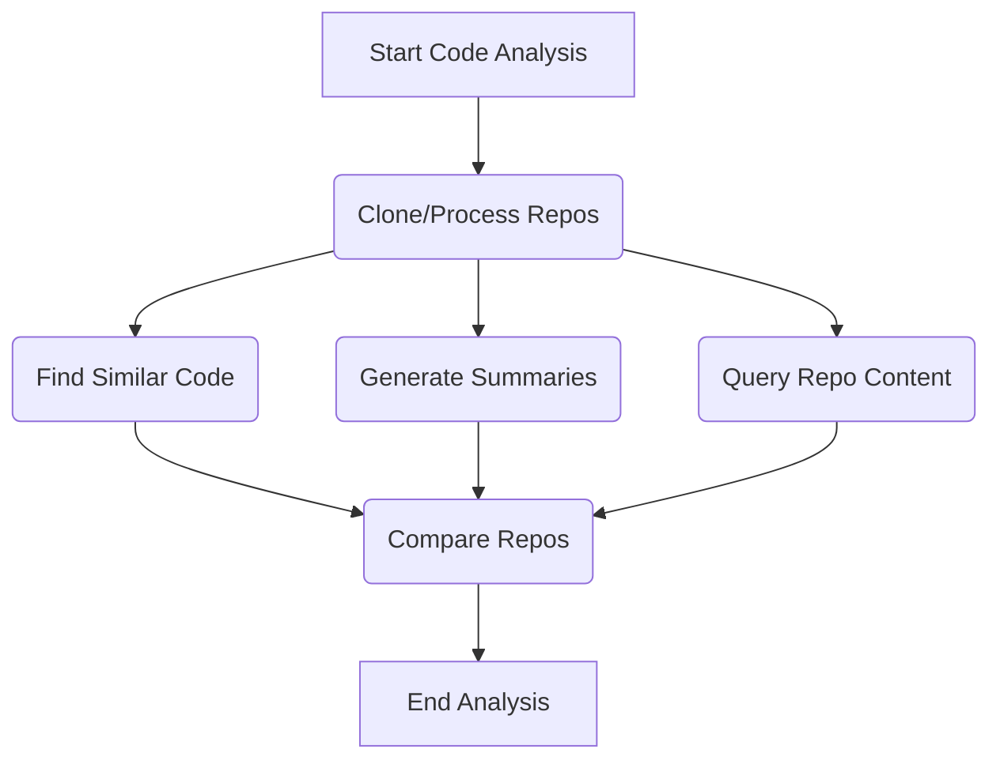

# OARC-Crawlers: Technical Specification

This document provides the technical specification for the OARC-Crawlers framework. It details the system architecture, individual components, data handling strategies, API usage, and common workflows, serving as a comprehensive guide for understanding and utilizing the framework.

## Table of Contents
- [1. Introduction](#1-introduction)
- [2. System Overview](#2-system-overview)
  - [2.1 Core Concepts](#21-core-concepts)
  - [2.2 Architecture](#22-architecture)
  - [2.3 Data Storage](#23-data-storage)
- [3. Components](#3-components)
- [4. API Reference](#4-api-reference)
- [5. Common Workflows](#5-common-workflows)
  - [5.1 Research Workflow](#51-research-workflow)
  - [5.2 Data Analysis Workflow](#52-data-analysis-workflow)
  - [5.3 Code Analysis Workflow](#53-code-analysis-workflow)
- [6. Error Handling and Logging](#6-error-handling-and-logging)
- [7. Performance Considerations](#7-performance-considerations)
- [8. Conclusion](#8-conclusion)
- [9. Appendix](#9-appendix)
  - [9.1 Glossary of Terms](#91-glossary-of-terms)
  - [9.2 Directory Structure](#92-directory-structure)

## 1. Introduction

OARC-Crawlers offers a framework for acquiring, processing, and storing data from diverse online sources. It is built on core principles like modularity and asynchronous operation, utilizing unified Apache Parquet storage for data persistence, as detailed throughout this specification. The system provides specialized crawlers and workflows designed to streamline data collection for researchers, data scientists, and developers.

## 2. System Overview

### 2.1 Core Concepts

The OARC-Crawlers framework operates on the following core principles:

1.  **Modularity**: Each data source is managed by a dedicated, specialized component (detailed in [Components](#3-components)).
2.  **Asynchronous Design**: Utilizes asynchronous programming for high-performance, non-blocking I/O operations (see [Performance Considerations](#7-performance-considerations)).
3.  **Unified Data Storage**: Employs Apache Parquet for consistent, efficient, and analysis-ready data persistence across all modules (see [Data Storage](#23-data-storage)).
4.  **Structured Outputs**: Delivers data in well-defined formats suitable for both machine processing (e.g., DataFrames, dictionaries) and human review (e.g., Markdown).
5.  **Resilience**: Integrates robust error handling and logging mechanisms to ensure operational stability (see [Error Handling and Logging](#6-error-handling-and-logging)).

### 2.2 Architecture

The OARC-Crawlers framework employs a modular architecture, aligning with the [Core Concepts](#21-core-concepts). Each data source (e.g., YouTube, GitHub, ArXiv) is managed by a dedicated, asynchronous crawler module, detailed in the [Components](#3-components) section.

Key architectural features include:
1.  **Independent Modules**: Each crawler operates independently, focusing on a specific data source.
2.  **Asynchronous Operations**: Leverages `async`/`await` for efficient, non-blocking I/O, crucial for network-bound tasks (see [Performance Considerations](#7-performance-considerations)).
3.  **Centralized Storage**: All modules utilize the `ParquetStorage` component for consistent data persistence in the Apache Parquet format ([Section 2.3](#23-data-storage)).
4.  **Consistent Initialization**: Crawlers are typically initialized with a `data_dir` parameter specifying the output location.

This design facilitates both the isolated use of individual crawlers and their combination within larger data acquisition workflows ([Section 5](#5-common-workflows)).

The overall interaction flow is depicted below:



### 2.3 Data Storage

Consistent with the core concept of [Unified Data Storage](#21-core-concepts), the OARC-Crawlers framework utilizes the Apache Parquet format for persistent data storage across all modules. This choice offers significant advantages aligned with the system's goals:

1.  **Columnar Storage**: Enables efficient data retrieval and analysis, particularly for queries targeting specific data columns.
2.  **Efficient Compression**: Reduces disk space usage and potentially speeds up I/O operations.
3.  **Schema Enforcement**: Helps maintain data consistency and integrity across diverse data sources and collection times.
4.  **Broad Interoperability**: Ensures compatibility with a wide range of data analysis tools and platforms, including Pandas, Apache Spark, and Apache Arrow.

All interactions with Parquet files (saving, loading, appending) are managed through the dedicated `ParquetStorage` component. This centralized approach guarantees a standardized mechanism for data persistence, ensuring consistency regardless of the specific crawler module generating the data.

The general flow for handling data destined for storage is illustrated below:



This unified storage strategy ensures that data from various sources is stored efficiently and is readily available for subsequent analysis workflows ([Section 5.2](#52-data-analysis-workflow)).

## 3. Components

The OARC-Crawlers framework includes several specialized components, each designed to interact with a specific data source:

1. **Parquet Storage**: The foundation for all data persistence operations, providing consistent saving, loading, and appending of data in the Parquet format.

2. **YouTube Downloader**: Facilitates downloading videos, playlists, and metadata from YouTube, as well as extracting captions and performing searches.

3. **GitHub Crawler**: Enables cloning, processing, and analyzing GitHub repositories, with a focus on code extraction and analysis.

4. **DuckDuckGo Searcher**: Performs web searches using the DuckDuckGo search engine API, supporting text, image, and news searches.

5. **BeautifulSoup Web Crawler**: Extracts content from web pages using BeautifulSoup, with specialized extractors for documentation sites and PyPI package pages.

6. **ArXiv Fetcher**: Downloads papers and extracts content from the ArXiv academic repository, including paper metadata and LaTeX source files.

For detailed information about each component, including architecture, data flow diagrams, implementation details, and advanced usage patterns, please refer to the dedicated [Crawlers documentation](./Crawlers.md).

## 4. API Reference

For detailed API reference documentation, please see the dedicated [API Reference document](./API.md).

The API document provides comprehensive information about all public methods, including:
- Method signatures with type annotations
- Parameters and return values
- Error handling behavior
- Detailed examples with realistic use cases
- Implementation notes for methods with specific behaviors or limitations

Each module's API is documented in detail:
- [Parquet Storage API](./API.md#1-parquet-storage-api)
- [YouTube Downloader API](./API.md#2-youtube-downloader-api)
- [GitHub Crawler API](./API.md#3-github-crawler-api)
- [DuckDuckGo Searcher API](./API.md#4-duckduckgo-searcher-api)
- [BeautifulSoup Web Crawler API](./API.md#5-beautifulsoup-web-crawler-api)
- [ArXiv Fetcher API](./API.md#6-arxiv-fetcher-api)

Asynchronous methods are clearly marked with the `async` keyword, and static methods are identified with the `@staticmethod` notation to help you understand how to use the API effectively.

## 5. Common Workflows

### 5.1 Research Workflow

One of the primary use cases for OARC-Crawlers is conducting research on specific topics by collecting information from multiple sources:

1.  Begin with a search query using the DuckDuckGoSearcher to get general information.
2.  Find relevant academic papers using the ArxivFetcher.
3.  Collect documentation from related websites using the BSWebCrawler.
4.  Find relevant GitHub repositories using the GitHubCrawler.
5.  Download educational videos using the YouTubeDownloader.
6.  Analyze and correlate the collected data.

This workflow is demonstrated in the `combined_example.py` file, which shows how multiple crawler modules can be used together to gather comprehensive information on a topic.



### 5.2 Data Analysis Workflow

Another common use case is analyzing previously collected data:

1.  Load data from various sources using `ParquetStorage`.
2.  Process and clean the data using Pandas.
3.  Analyze relationships between different data sources.
4.  Export results to CSV or other formats for visualization.
5.  Generate reports based on the findings.

The Parquet format makes it easy to load and analyze the data using standard data science tools.



### 5.3 Code Analysis Workflow

For analyzing code repositories:

1.  Use `GitHubCrawler` to clone and process repositories.
2.  Find patterns in the code using `find_similar_code`.
3.  Generate summaries of repository contents.
4.  Search for specific code features using `query_repo_content`.
5.  Compare multiple repositories to identify common patterns.

This workflow is particularly useful for software engineers and researchers studying code patterns.



## 6. Error Handling and Logging

Robust error handling and comprehensive logging are integral to the OARC-Crawlers framework, ensuring operational stability and providing clear diagnostics, aligning with the core concept of [Resilience](#21-core-concepts).

1.  **Standardized Logging**:
    *   All modules utilize Python's built-in `logging` module for consistency and compatibility with standard logging configurations.
    *   Log levels are employed semantically:
        *   `INFO`: Tracks normal operational progress (e.g., starting a download, completing a search).
        *   `WARNING`: Indicates potential issues or non-critical errors that don't halt the current operation (e.g., skipping an unreadable file, encountering an unexpected data format).
        *   `ERROR`: Reports failures that prevent a specific operation from completing (e.g., network connection failure, API error, invalid URL).
        *   `DEBUG` (if configured): Provides detailed diagnostic information for troubleshooting.
    *   Logs provide traceability for operations and are crucial for diagnosing issues during development or production use.

2.  **Exception Handling Strategy**:
    *   The framework aims to contain errors within specific operations rather than allowing exceptions to halt entire workflows.
    *   Common exceptions (e.g., `ConnectionError`, `TimeoutError`, `IOError`, `PermissionError`, API-specific errors, `ValueError`, `TypeError`) are typically caught within the relevant methods (e.g., fetching a single URL, processing one file).
    *   Instead of raising exceptions directly from high-level crawler methods, these methods often return structured output (e.g., a dictionary, `None`, or partial results) that includes status information and specific error messages if an operation failed. For example, attempting to download a playlist might successfully download several videos but return information about any videos that failed due to errors, allowing the overall process to complete.

3.  **Resilience in Workflows**:
    *   This combination of detailed logging and contained error handling makes the framework resilient to transient issues like network interruptions or problems with specific data items.
    *   Workflows ([Section 5](#5-common-workflows)) involving multiple steps or processing numerous items (e.g., crawling multiple repositories, downloading many videos) can continue operating even if individual sub-tasks fail, maximizing data acquisition efforts. Users can then inspect logs or error statuses in the results to identify and potentially retry failed operations.

## 7. Performance Considerations

The performance of the OARC-Crawlers framework is optimized through several key design choices and features:

1.  **Asynchronous Operations**: Core to the framework's design ([Section 2.1](#21-core-concepts)), all network-bound and I/O-intensive operations (e.g., fetching web pages, downloading files, interacting with APIs) utilize Python's `async`/`await` syntax. This allows for concurrent handling of multiple operations, significantly improving throughput compared to synchronous approaches, especially when dealing with network latency.
2.  **Efficient Data Storage**: The adoption of Apache Parquet ([Section 2.3](#23-data-storage)) via the `ParquetStorage` component offers performance benefits. Its columnar nature allows for efficient compression and faster querying, particularly when only specific data columns are needed for analysis.
3.  **Resource Management**: The framework incorporates mechanisms for managing resources effectively. This includes careful handling of network connections (e.g., using `aiohttp.ClientSession`) and automatic cleanup of temporary files where applicable (e.g., during repository cloning in `GitHubCrawler`).
4.  **Configurable Limits**: Most crawler modules provide parameters to limit the scope of operations (e.g., `max_results` in `DuckDuckGoSearcher`, `limit` in `YouTubeDownloader`). These limits help prevent accidental resource exhaustion and allow users to control the scale of data collection.
5.  **Selective Processing**: Components like the `GitHubCrawler` include logic to identify and potentially skip processing large or binary files, focusing efforts on relevant text-based content and improving overall processing speed.

For large-scale data collection tasks, users should consider the following:
*   Ensure the execution environment has adequate RAM, CPU, and disk storage capacity.
*   Utilize the available configuration options (e.g., download limits, search result counts) to manage resource consumption.
*   For extremely large workloads, consider distributing tasks across multiple instances or integrating the crawlers into a larger distributed processing system (e.g., using task queues like Celery or RQ).

## 8. Conclusion

OARC-Crawlers offers a robust and extensible framework for acquiring and analyzing data from diverse online sources, including YouTube, GitHub, ArXiv, and general web pages. Its modular architecture, built upon asynchronous operations and unified Parquet storage, ensures efficient, scalable, and resilient data collection. By providing specialized crawlers with consistent interfaces and structured outputs, OARC-Crawlers streamlines complex data gathering workflows, making it a valuable tool for researchers, data scientists, and developers.

## 9. Appendix

### 9.1 Glossary of Terms

| Term | Definition |
|---|---|
| **aiohttp** | Asynchronous HTTP client/server framework for Python. |
| **API** | Application Programming Interface. |
| **Arrow** | Apache Arrow, a cross-language development platform for in-memory data, often used with Parquet. |
| **ArXiv** | Online repository of electronic preprints for scientific papers. |
| **Async/Await** | Python's asynchronous programming model. |
| **BeautifulSoup** | Python library for pulling data out of HTML and XML files. |
| **Binary File** | Non-text file format (e.g., images, videos, executables). |
| **Columnar Storage** | Data storage technique where data is stored by columns rather than rows, used by Parquet. |
| **ConnectionError** | Python exception raised for network connection issues. |
| **Crawler** | Software that automatically browses the Web and collects data. |
| **DataFrame** | Two-dimensional labeled data structure in Pandas. |
| **DuckDuckGo** | Privacy-focused search engine. |
| **Git** | Distributed version control system. |
| **GitHub** | Web-based hosting service for Git repositories. |
| **GitPython** | Python library to interact with Git repositories. |
| **IOError** | Python exception raised for input/output errors (often an alias for `OSError`). |
| **JSON** | JavaScript Object Notation, a lightweight data-interchange format. |
| **LaTeX** | Document preparation system for scientific documents. |
| **Logging** | Recording events that occur in software. |
| **Markdown** | Lightweight markup language with plain-text formatting syntax. |
| **Mermaid** | Javascript based diagramming and charting tool that renders Markdown-inspired text definitions. |
| **Pandas** | Python library providing high-performance, easy-to-use data structures and data analysis tools. |
| **Parquet** | Columnar storage file format in the Apache Hadoop ecosystem. |
| **PermissionError** | Python exception raised when trying to run an operation without the adequate access rights. |
| **PyPI** | Python Package Index, a repository of software for Python. |
| **pyarrow** | Python library for Apache Arrow, used for Parquet handling. |
| **Pytube** | Python library for downloading YouTube videos. |
| **Repository** | Storage location for software packages or code. |
| **Schema** | The structure or definition of data organization, often enforced in Parquet files. |
| **Semantic Search** | Search technique that aims to understand the intent and contextual meaning of search queries. |
| **Sphinx** | Documentation generator used heavily in the Python ecosystem. |
| **SRT** | SubRip Text file format for subtitles. |
| **TypeError** | Python exception raised when an operation or function is applied to an object of an inappropriate type. |
| **Type Hinting** | Static type hints for Python code (e.g., `Union`, `Optional`, `Dict`, `List`), improving readability and allowing static analysis. |
| **URL** | Uniform Resource Locator, web address. |
| **User-Agent** | HTTP header field identifying the client software originating the request. |
| **UTF-8** | Character encoding capable of encoding all Unicode characters. |
| **ValueError** | Python exception raised when a function receives an argument of the correct type but an inappropriate value. |
| **XML** | Extensible Markup Language, a markup language for encoding documents. |
| **YouTube** | Video sharing platform. |
| **YouTube Data API** | Google API for interacting with YouTube features programmatically. |

### 9.2 Directory Structure

```
oarc-crawlers/
├── data/                        # Default data storage directory
│   ├── youtube_data/            # YouTube downloads and metadata
│   │   ├── videos/              # Downloaded videos
│   │   ├── metadata/            # Video metadata
│   │   ├── captions/            # Video captions
│   │   └── searches/            # Search results
│   ├── github_repos/            # GitHub repository data
│   ├── searches/                # DuckDuckGo search results
│   ├── crawls/                  # Web crawl results
│   ├── papers/                  # ArXiv paper metadata
│   └── sources/                 # ArXiv paper source files
├── docs/                        # Documentation
│   ├── API.md                   # API reference documentation
│   ├── Crawlers.md              # Detailed crawler documentation
│   └── Specification.md         # This specification document
├── examples/                    # Example usage scripts
│   ├── arxiv_example.py         # ArXiv fetcher examples
│   ├── beautifulsoup_example.py # Web crawler examples
│   ├── combined_example.py      # Combined usage of multiple crawlers
│   ├── ddg_example.py           # DuckDuckGo searcher examples
│   ├── github_example.py        # GitHub crawler examples
│   ├── run_example.py           # Script to run examples
│   └── youtube_example.py       # YouTube downloader examples
├── src/                         # Source code
│   ├── arxiv_fetcher.py         # ArXiv paper fetcher
│   ├── beautiful_soup.py        # Web crawler using BeautifulSoup
│   ├── ddg_search.py            # DuckDuckGo search interface
│   ├── gh_crawler.py            # GitHub repository crawler
│   ├── parquet_storage.py       # Parquet file storage utilities
│   ├── youtube_script.py        # YouTube download utilities
│   └── __init__.py              # Package initialization
├── tests/                       # Unit tests
│   ├── test_arxiv.py            # ArXiv fetcher tests
│   ├── test_bs_crawler.py       # Web crawler tests
│   ├── test_ddg.py              # DuckDuckGo searcher tests
│   ├── test_github_crawler.py   # GitHub crawler tests
│   ├── test_parquet_storage.py  # Parquet storage tests
│   └── test_youtube_script.py   # YouTube downloader tests
├── run_tests.py                 # Script to run all tests
└── README.md                    # Project overview
```
