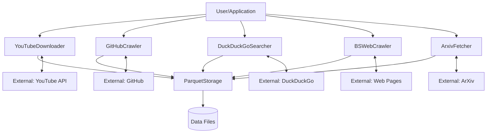
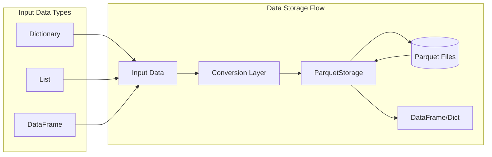
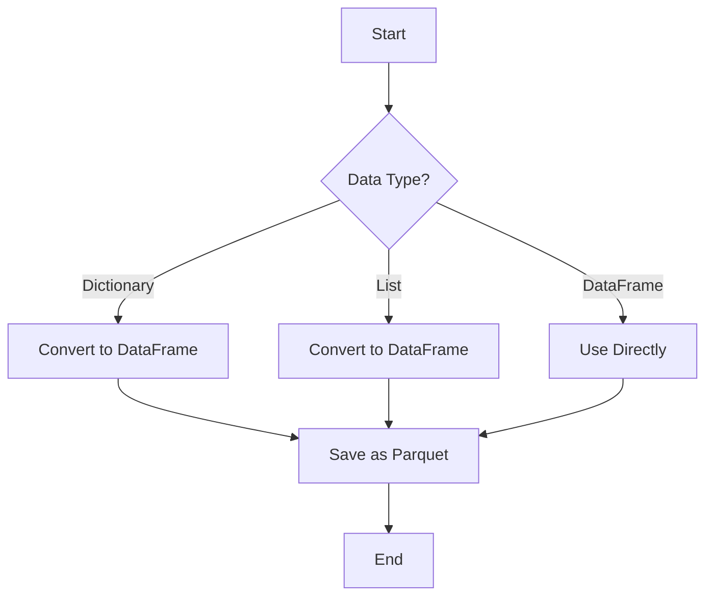
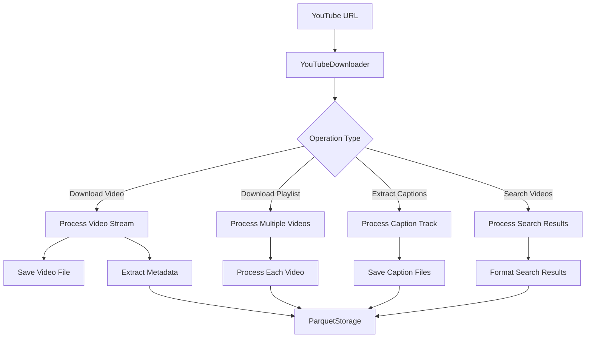
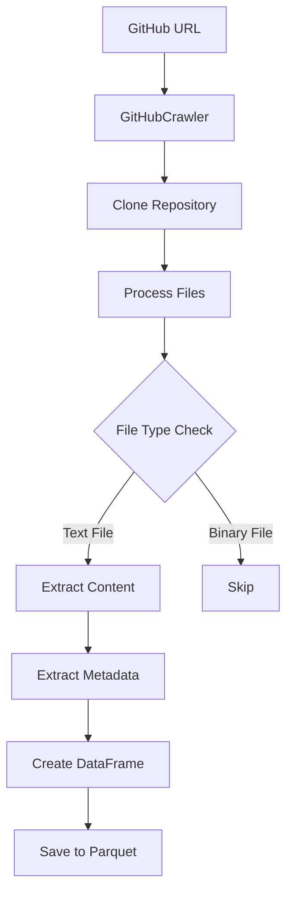
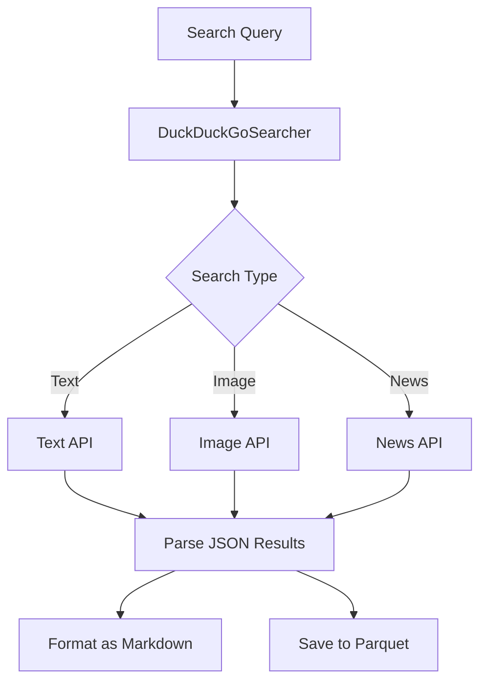
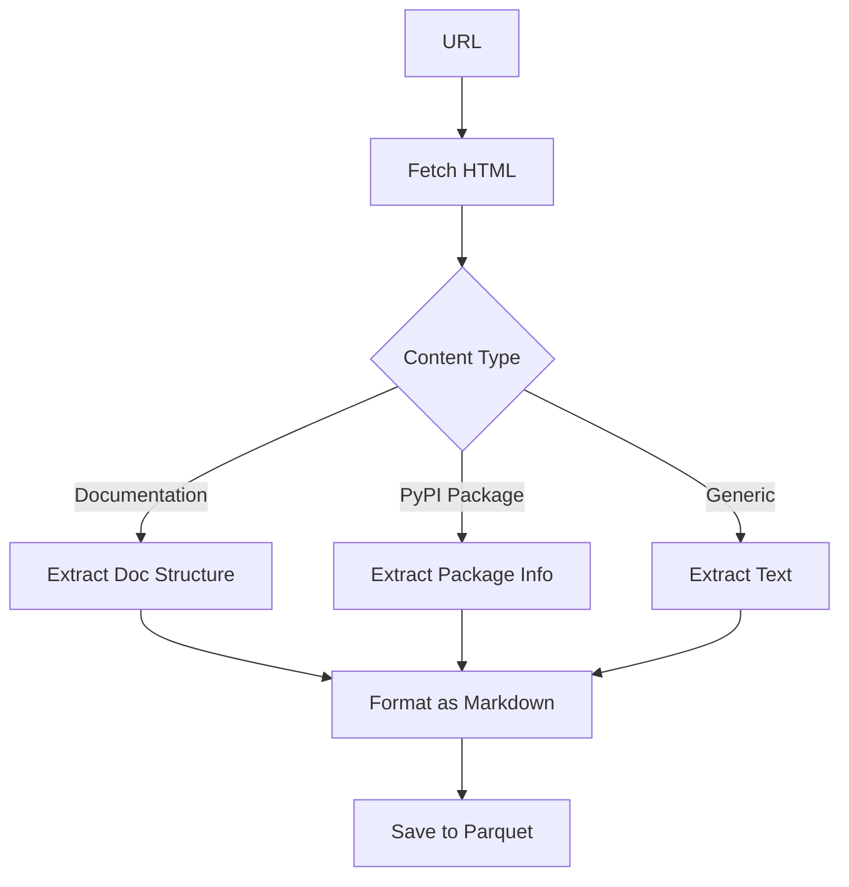
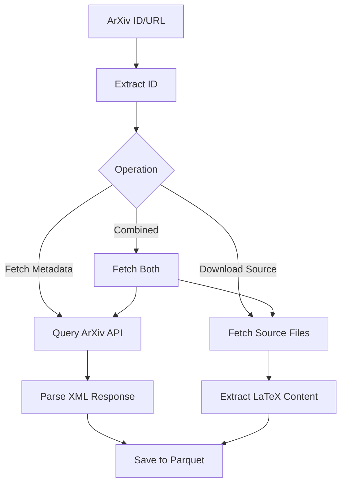

# OARC-Crawlers Specification

## Table of Contents
- [1. Introduction](#1-introduction)
- [2. System Overview](#2-system-overview)
  - [2.1 Core Concepts](#21-core-concepts)
  - [2.2 Architecture](#22-architecture)
  - [2.3 Data Storage](#23-data-storage)
- [3. Components](#3-components)
  - [3.1 Parquet Storage](#31-parquet-storage)
  - [3.2 YouTube Downloader](#32-youtube-downloader)
  - [3.3 GitHub Crawler](#33-github-crawler)
  - [3.4 DuckDuckGo Searcher](#34-duckduckgo-searcher)
  - [3.5 BeautifulSoup Web Crawler](#35-beautifulsoup-web-crawler)
  - [3.6 ArXiv Fetcher](#36-arxiv-fetcher)
- [4. API Reference](#4-api-reference)
- [5. Common Workflows](#5-common-workflows)
  - [5.1 Research Workflow](#51-research-workflow)
  - [5.2 Data Analysis Workflow](#52-data-analysis-workflow)
  - [5.3 Code Analysis Workflow](#53-code-analysis-workflow)
- [6. Error Handling and Logging](#6-error-handling-and-logging)
- [7. Performance Considerations](#7-performance-considerations)
- [8. Conclusion](#8-conclusion)
- [9. Appendix](#9-appendix)
  - [9.1 Glossary of Terms](#91-glossary-of-terms)
  - [9.2 Directory Structure](#92-directory-structure)

## 1. Introduction

OARC-Crawlers is a comprehensive collection of web crawlers and data extractors designed to gather information from various online sources, process it, and store it in a standardized format. The system enables researchers, data scientists, and developers to efficiently collect and analyze data from YouTube videos, GitHub repositories, web pages, search engines, and academic papers.

The core design principle of OARC-Crawlers is to provide a unified interface for diverse data sources, with consistent storage mechanisms and easy-to-use APIs. Each crawler module is designed to handle the specific intricacies of its target platform while maintaining a common usage pattern for the end-user.

This specification document outlines the architecture, components, APIs, and usage patterns of the OARC-Crawlers system. It serves as a comprehensive reference for developers working with the codebase, as well as users looking to leverage the system's capabilities for data collection and analysis.

## 2. System Overview

### 2.1 Core Concepts

OARC-Crawlers is built around several key concepts:

1. **Modular Crawlers**: Each data source has a dedicated crawler class specialized for that domain.
2. **Asynchronous Operation**: All data retrieval operations are implemented as asynchronous functions, allowing for efficient concurrent processing.
3. **Unified Storage**: All data is stored in Apache Parquet format, providing efficient compression and query capabilities.
4. **Structured Output**: All crawlers provide structured outputs in both programmatic formats (DataFrames, dictionaries) and human-readable formats (Markdown).
5. **Error Resilience**: Built-in error handling ensures that failures in data retrieval don't cause system failures.

### 2.2 Architecture

OARC-Crawlers follows a modular architecture where each crawler is implemented as a separate class with a consistent interface pattern:

1. **Initialization**: Each crawler accepts a `data_dir` parameter for specifying where data should be stored.
2. **Retrieval Methods**: Methods for retrieving different types of data from the source.
3. **Processing Methods**: Functions for transforming and processing the retrieved data.
4. **Format Methods**: Functions for converting the processed data into human-readable formats.
5. **Storage Integration**: All crawlers use the ParquetStorage class for data persistence.

The system is designed for both standalone use of individual crawlers and combined use of multiple crawlers for more complex data collection tasks.



### 2.3 Data Storage

All data retrieved by OARC-Crawlers is stored using the Apache Parquet format, which offers several advantages:

1. **Columnar Storage**: Efficient for analytical queries that operate on specific columns.
2. **Compression**: Built-in compression reduces storage requirements.
3. **Schema Enforcement**: Ensures data consistency across operations.
4. **Interoperability**: Compatible with big data tools like Spark, Pandas, and Arrow.

The ParquetStorage class provides a unified interface for saving, loading, and appending data across all crawler modules.



## 3. Components

### 3.1 Parquet Storage

The foundation of the OARC-Crawlers system is the ParquetStorage utility, which provides a standardized mechanism for data persistence across all crawler modules.

**Key Features:**
- Saving dictionaries, lists, and DataFrames to Parquet files
- Loading Parquet files into Pandas DataFrames
- Appending new data to existing Parquet files
- Automatic conversion between data types
- Error handling for file operations

ParquetStorage serves as the bridge between the various crawler modules and the persistent data store, ensuring that all data is stored in a consistent and efficient format.

**Implementation Pattern:**
```python
# Typical usage pattern for ParquetStorage
from parquet_storage import ParquetStorage

# Saving data
data = {'key': 'value', 'metrics': [1, 2, 3], 'timestamp': '2023-01-01'}
ParquetStorage.save_to_parquet(data, 'path/to/file.parquet')

# Loading data
df = ParquetStorage.load_from_parquet('path/to/file.parquet')

# Appending data
new_data = {'key': 'new_value', 'metrics': [4, 5, 6], 'timestamp': '2023-01-02'}
ParquetStorage.append_to_parquet(new_data, 'path/to/file.parquet')
```

**Data Handling Flow:**


### 3.2 YouTube Downloader

The YouTubeDownloader module facilitates downloading videos, playlists, and metadata from YouTube, as well as extracting captions and performing searches.

**Key Features:**
- Download individual videos with customizable format and resolution
- Download entire playlists with configurable limits
- Extract captions/subtitles in multiple languages
- Search for videos and retrieve metadata
- Save all data and metadata in Parquet format
- Extract audio from videos

The module leverages the pytube library for interacting with YouTube and provides additional functionality for organizing and storing the retrieved data.

**Typical Usage Pattern:**
```python
# Example of downloading a YouTube video
from youtube_script import YouTubeDownloader

async def download_example():
    downloader = YouTubeDownloader(data_dir="./data")
    
    # Download a single video
    video_info = await downloader.download_video(
        url="https://www.youtube.com/watch?v=dQw4w9WgXcQ",
        format="mp4",
        resolution="720p"
    )
    
    # Extract captions
    captions = await downloader.extract_captions(
        url="https://www.youtube.com/watch?v=dQw4w9WgXcQ",
        languages=["en", "es"]
    )
    
    # Search for videos
    search_results = await downloader.search_videos(
        query="machine learning tutorial",
        limit=5
    )
    
    return video_info, captions, search_results
```

**Processing Architecture:**


### 3.3 GitHub Crawler

The GitHubCrawler module enables cloning, processing, and analyzing GitHub repositories, with a focus on code extraction and analysis.

**Key Features:**
- Clone repositories using Git
- Process repository files into a structured DataFrame
- Extract file metadata (language, size, author, etc.)
- Generate repository summaries
- Find similar code across repositories
- Query repository content using natural language

This module combines Git operations with file processing capabilities to provide a comprehensive view of repository contents and structure.

**Example Usage:**
```python
# Example of analyzing a GitHub repository
from gh_crawler import GitHubCrawler

async def analyze_repo():
    crawler = GitHubCrawler(data_dir="./data")
    
    # Clone and analyze a repository
    repo_path = await crawler.clone_and_store_repo(
        "https://github.com/username/repository"
    )
    
    # Generate a summary
    summary = await crawler.get_repo_summary(
        "https://github.com/username/repository"
    )
    
    # Find similar code
    similar_code = await crawler.find_similar_code(
        "https://github.com/username/repository",
        "def calculate_mean(values):\n    return sum(values) / len(values)"
    )
    
    return summary, similar_code
```

**Repository Processing Workflow:**


### 3.4 DuckDuckGo Searcher

The DuckDuckGoSearcher module performs web searches using the DuckDuckGo search engine API, supporting text, image, and news searches.

**Key Features:**
- Text search with formatted results
- Image search with embedded images
- News search with source attribution
- Save search results in Parquet format
- Format results as Markdown for easy viewing

The module provides a privacy-respecting alternative to other search engines and formats results for easy consumption by other parts of the system.

**Usage Example:**
```python
# Example of performing searches with DuckDuckGo
from ddg_search import DuckDuckGoSearcher

async def search_example():
    searcher = DuckDuckGoSearcher(data_dir="./data")
    
    # Perform a text search
    text_results = await searcher.text_search(
        "python web crawlers",
        max_results=5
    )
    
    # Perform an image search
    image_results = await searcher.image_search(
        "data visualization",
        max_results=10
    )
    
    # Perform a news search
    news_results = await searcher.news_search(
        "machine learning advances",
        max_results=8
    )
    
    return text_results, image_results, news_results
```

**Search Process Flow:**


### 3.5 BeautifulSoup Web Crawler

The BSWebCrawler module extracts content from web pages using BeautifulSoup, with specialized extractors for documentation sites and PyPI package pages.

**Key Features:**
- Fetch HTML content from URLs
- Extract text content from HTML pages
- Extract structured documentation content
- Extract PyPI package information
- Format extracted content as Markdown
- Save crawled content in Parquet format

This module is particularly useful for extracting documentation and technical information from websites, with special support for common documentation formats.

**Example Usage:**
```python
# Example of crawling web content
from beautiful_soup import BSWebCrawler

async def crawl_example():
    crawler = BSWebCrawler(data_dir="./data")
    
    # Crawl a documentation site
    docs_content = await crawler.crawl_documentation_site(
        "https://docs.python.org/3/library/asyncio.html"
    )
    
    # Fetch a URL and extract text
    html_content = await BSWebCrawler.fetch_url_content(
        "https://www.python.org/about/"
    )
    text_content = await BSWebCrawler.extract_text_from_html(html_content)
    
    return docs_content, text_content
```

**Content Extraction Flow:**


### 3.6 ArXiv Fetcher

The ArxivFetcher module downloads papers and extracts content from the ArXiv academic repository, including paper metadata and LaTeX source files.

**Key Features:**
- Fetch paper metadata from ArXiv API
- Download LaTeX source files
- Format paper information for learning
- Extract ArXiv IDs from URLs
- Save paper data in Parquet format

This module is specifically designed for academic research and facilitates the collection and analysis of scientific papers.

**Example Usage:**
```python
# Example of fetching academic papers
from arxiv_fetcher import ArxivFetcher

async def arxiv_example():
    fetcher = ArxivFetcher(data_dir="./data")
    
    # Fetch paper metadata
    paper_info = await fetcher.fetch_paper_info("2103.13630")
    
    # Download source files
    source_info = await fetcher.download_source("2103.13630")
    
    # Get paper with LaTeX content
    complete_info = await fetcher.fetch_paper_with_latex("2103.13630")
    
    # Format for learning
    formatted = await ArxivFetcher.format_paper_for_learning(paper_info)
    
    return paper_info, formatted
```

**Paper Processing Flow:**


## 4. API Reference

For detailed API reference documentation, please see the dedicated [API Reference document](./API.md).

The API document provides comprehensive information about all public methods, parameters, return values, and examples for each module:

- [Parquet Storage API](./API.md#1-parquet-storage-api)
- [YouTube Downloader API](./API.md#2-youtube-downloader-api)
- [GitHub Crawler API](./API.md#3-github-crawler-api)
- [DuckDuckGo Searcher API](./API.md#4-duckduckgo-searcher-api)
- [BeautifulSoup Web Crawler API](./API.md#5-beautifulsoup-web-crawler-api)
- [ArXiv Fetcher API](./API.md#6-arxiv-fetcher-api)

Each method is documented with its signature, parameters, return values, and example usage code to help you understand how to use the API effectively.

## 5. Common Workflows

### 5.1 Research Workflow

One of the primary use cases for OARC-Crawlers is conducting research on specific topics by collecting information from multiple sources:

1. Begin with a search query using the DuckDuckGoSearcher to get general information
2. Find relevant academic papers using the ArxivFetcher
3. Collect documentation from related websites using the BSWebCrawler
4. Find relevant GitHub repositories using the GitHubCrawler
5. Download educational videos using the YouTubeDownloader
6. Analyze and correlate the collected data

This workflow is demonstrated in the combined_example.py file, which shows how multiple crawler modules can be used together to gather comprehensive information on a topic.

### 5.2 Data Analysis Workflow

Another common use case is analyzing previously collected data:

1. Load data from various sources using ParquetStorage
2. Process and clean the data using Pandas
3. Analyze relationships between different data sources
4. Export results to CSV or other formats for visualization
5. Generate reports based on the findings

The Parquet format makes it easy to load and analyze the data using standard data science tools.

### 5.3 Code Analysis Workflow

For analyzing code repositories:

1. Use GitHubCrawler to clone and process repositories
2. Find patterns in the code using `find_similar_code`
3. Generate summaries of repository contents
4. Search for specific code features using `query_repo_content`
5. Compare multiple repositories to identify common patterns

This workflow is particularly useful for software engineers and researchers studying code patterns.

## 6. Error Handling and Logging

OARC-Crawlers implements a consistent error handling and logging strategy:

1. All modules use Python's built-in logging module
2. Log levels are used appropriately (INFO for normal operation, WARNING for potential issues, ERROR for failures)
3. Exceptions are caught and logged, with informative error messages
4. Failed operations return dictionaries with error information rather than raising exceptions
5. When errors occur, the system attempts to continue with the next operation rather than aborting

This makes the crawlers more resilient to network issues, API changes, and other potential failure points.

## 7. Performance Considerations

Key performance aspects of the OARC-Crawlers system:

1. **Asynchronous Operations**: All network and I/O operations are implemented as async functions for improved efficiency
2. **Parquet Storage**: The columnar storage format provides efficient compression and query performance
3. **Resource Management**: Automatic cleanup of temporary files and proper handling of network connections
4. **Size Limits**: Configurable limits on file sizes, number of results, etc. to prevent resource exhaustion
5. **Binary Detection**: Automatic detection and skipping of binary files to improve processing efficiency

For large-scale data collection, consider:
- Running the crawlers on a machine with sufficient memory and disk space
- Setting appropriate limits on download sizes and result counts
- Implementing task queues for very large collections

## 8. Conclusion

OARC-Crawlers provides a comprehensive toolkit for collecting, processing, and analyzing data from a wide range of online sources. By combining specialized crawler modules with a unified storage system, it enables efficient research workflows and data analysis tasks.

The modular architecture makes it easy to extend the system with new data sources or to modify the behavior of existing crawlers. The consistent interface pattern and error handling strategy ensure that adding new features doesn't compromise the reliability of the system.

Whether used for academic research, software development, or data science projects, OARC-Crawlers offers a flexible and powerful set of tools for working with online information. The combination of asynchronous operations, structured data storage, and specialized processing features makes it particularly well-suited for complex data collection and analysis tasks.

## 9. Appendix

### 9.1 Glossary of Terms

| Term | Definition |
|---|---|
| **API** | Application Programming Interface |
| **Async/Await** | Python's asynchronous programming model |
| **ArXiv** | Online repository of electronic preprints for scientific papers |
| **BeautifulSoup** | Python library for pulling data out of HTML and XML files |
| **Binary File** | Non-text file format (e.g., images, videos, executables) |
| **Crawler** | Software that automatically browses the Web and collects data |
| **DataFrame** | Two-dimensional labeled data structure in Pandas |
| **DuckDuckGo** | Privacy-focused search engine |
| **Git** | Distributed version control system |
| **GitHub** | Web-based hosting service for Git repositories |
| **LaTeX** | Document preparation system for scientific documents |
| **Markdown** | Lightweight markup language with plain-text formatting syntax |
| **Parquet** | Columnar storage file format in the Apache Hadoop ecosystem |
| **PyPI** | Python Package Index, a repository of software for Python |
| **Pytube** | Python library for downloading YouTube videos |
| **Repository** | Storage location for software packages |
| **SRT** | SubRip Text file format for subtitles |
| **URL** | Uniform Resource Locator, web address |
| **UTF-8** | Character encoding capable of encoding all Unicode characters |
| **YouTube** | Video sharing platform |

### 9.2 Directory Structure

```
oarc-crawlers/
├── data/                        # Default data storage directory
│   ├── youtube_data/            # YouTube downloads and metadata
│   │   ├── videos/              # Downloaded videos
│   │   ├── metadata/            # Video metadata
│   │   ├── captions/            # Video captions
│   │   └── searches/            # Search results
│   ├── github_repos/            # GitHub repository data
│   ├── searches/                # DuckDuckGo search results
│   ├── crawls/                  # Web crawl results
│   ├── papers/                  # ArXiv paper metadata
│   └── sources/                 # ArXiv paper source files
├── docs/                        # Documentation
│   └── Specification.md         # This specification document
├── examples/                    # Example usage scripts
│   ├── arxiv_example.py         # ArXiv fetcher examples
│   ├── beautifulsoup_example.py # Web crawler examples
│   ├── combined_example.py      # Combined usage of multiple crawlers
│   ├── ddg_example.py           # DuckDuckGo searcher examples
│   ├── github_example.py        # GitHub crawler examples
│   ├── run_example.py           # Script to run examples
│   └── youtube_example.py       # YouTube downloader examples
├── src/                         # Source code
│   ├── arxiv_fetcher.py         # ArXiv paper fetcher
│   ├── beautiful_soup.py        # Web crawler using BeautifulSoup
│   ├── ddg_search.py            # DuckDuckGo search interface
│   ├── gh_crawler.py            # GitHub repository crawler
│   ├── parquet_storage.py       # Parquet file storage utilities
│   ├── youtube_script.py        # YouTube download utilities
│   └── __init__.py              # Package initialization
├── tests/                       # Unit tests
│   ├── test_arxiv.py            # ArXiv fetcher tests
│   ├── test_bs_crawler.py       # Web crawler tests
│   ├── test_ddg.py              # DuckDuckGo searcher tests
│   ├── test_github_crawler.py   # GitHub crawler tests
│   ├── test_parquet_storage.py  # Parquet storage tests
│   └── test_youtube_script.py   # YouTube downloader tests
├── run_tests.py                 # Script to run all tests
└── README.md                    # Project overview
```
````
